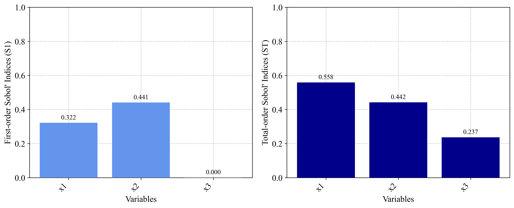

# PyEGRO.sensitivity.SApce Usage Examples

This document provides examples of how to use the PyEGRO.sensitivity.SApce module for sensitivity analysis using Polynomial Chaos Expansion (PCE).

## Table of Contents

1. [Quick Start](#quick-start)
   - [Basic Setup](#basic-setup)
   - [Running the Analysis](#running-the-analysis)
2. [Working with Different Models](#working-with-different-models)
   - [Using a Direct Function](#using-a-direct-function)
   - [Using a Surrogate Model](#using-a-surrogate-model)
3. [Example Applications](#example-applications)
   - [Ishigami Function](#ishigami-function)
   - [Rosenbrock Function](#rosenbrock-function)
   - [Borehole Function](#borehole-function)
   - [Circuit Design Problem](#circuit-design-problem)

---

## Quick Start

### Basic Setup

The simplest way to use the PyEGRO.sensitivity.SApce module is with the convenience function `run_sensitivity_analysis`.

```python
import numpy as np
from PyEGRO.sensitivity.SApce import run_sensitivity_analysis

# Define a simple test function
def test_function(X):
    """
    Simple quadratic function with interactions.
    """
    x1 = X[:, 0]
    x2 = X[:, 1]
    x3 = X[:, 2]
    
    return x1**2 + 0.5*x2**2 + 0.1*x3**2 + 0.7*x1*x2 + 0.2*x2*x3
    
# Define data_info with variable definitions
data_info = {
    'variables': [
        {
            'name': 'x1',
            'vars_type': 'design_vars',
            'distribution': 'uniform',
            'range_bounds': [-1, 1],
            'description': 'First input variable'
        },
        {
            'name': 'x2',
            'vars_type': 'design_vars',
            'distribution': 'uniform',
            'range_bounds': [-1, 1],
            'description': 'Second input variable'
        },
        {
            'name': 'x3',
            'vars_type': 'design_vars',
            'distribution': 'uniform',
            'range_bounds': [-1, 1],
            'description': 'Third input variable'
        }
    ]
}

# Save data_info to a JSON file
import json
import os

os.makedirs("DATA_PREPARATION", exist_ok=True)
with open("DATA_PREPARATION/data_info.json", 'w') as f:
    json.dump(data_info, f)

# Run the analysis
results_df = run_sensitivity_analysis(
    data_info_path="DATA_PREPARATION/data_info.json",
    true_func=test_function,
    polynomial_order=3,
    num_samples=500,
    output_dir="RESULT_SA_QUADRATIC",
    random_seed=42,
    show_progress=True
)

# Print the results
print("\nSensitivity Indices:")
print(results_df)
```

### Running the Analysis

For more control over the analysis process, you can use the `PCESensitivityAnalysis` class directly:

```python
from PyEGRO.sensitivity.SApce import PCESensitivityAnalysis

# Initialize the analysis
analyzer = PCESensitivityAnalysis(
    data_info_path="DATA_PREPARATION/data_info.json",
    true_func=test_function,
    output_dir="RESULT_SA_DETAILED",
    show_variables_info=True,
    random_seed=42
)

# Run the analysis
results_df = analyzer.run_analysis(
    polynomial_order=4,  # Higher order for more accuracy
    num_samples=1000,
    show_progress=True
)

# Examine the summary statistics
import json
with open("RESULT_SA_DETAILED/analysis_summary.json", 'r') as f:
    summary = json.load(f)
    
print("\nAnalysis Summary:")
for key, value in summary.items():
    print(f"{key}: {value}")
```

## Working with Different Models

### Using a Direct Function

For analytical functions or inexpensive simulations, you can directly use the function for evaluations:

```python
import numpy as np
from PyEGRO.sensitivity.SApce import run_sensitivity_analysis

# Define a complex function with interactions
def complex_function(X):
    """
    Function with various non-linear effects and interactions.
    """
    x1, x2, x3, x4 = X[:, 0], X[:, 1], X[:, 2], X[:, 3]
    
    # Different term types
    linear = 2*x1 + x2
    quadratic = 3*x1**2 + 0.5*x2**2 + 0.1*x3**2
    interaction = 2*x1*x2 + 0.7*x2*x3 + 0.3*x3*x4
    non_linear = np.sin(x1) + np.exp(0.1*x2) + np.sqrt(np.abs(x3)) + np.log(np.abs(x4) + 1)
    
    return linear + quadratic + interaction + non_linear

# Define data_info
data_info = {
    'variables': [
        {
            'name': 'x1',
            'vars_type': 'design_vars',
            'distribution': 'uniform',
            'range_bounds': [-1, 1],
            'description': 'First variable'
        },
        {
            'name': 'x2',
            'vars_type': 'design_vars',
            'distribution': 'normal',
            'range_bounds': [-2, 2],
            'cov': 0.1,
            'description': 'Second variable'
        },
        {
            'name': 'x3',
            'vars_type': 'env_vars',
            'distribution': 'normal',
            'mean': 0,
            'std': 1,
            'description': 'Third variable'
        },
        {
            'name': 'x4',
            'vars_type': 'env_vars',
            'distribution': 'uniform',
            'low': -2,
            'high': 2,
            'description': 'Fourth variable'
        }
    ]
}

# Save data_info
import json
with open("DATA_PREPARATION/complex_data_info.json", 'w') as f:
    json.dump(data_info, f)

# Run analysis
results_df = run_sensitivity_analysis(
    data_info_path="DATA_PREPARATION/complex_data_info.json",
    true_func=complex_function,
    polynomial_order=4,
    num_samples=1000,
    output_dir="RESULT_SA_COMPLEX",
    show_progress=True
)

# Print top influential variables
sorted_results = results_df.sort_values('Total-order', ascending=False)
print("\nVariables Ranked by Total-order Influence:")
print(sorted_results[['Parameter', 'Total-order', 'First-order']])
```

### Using a Surrogate Model

For computationally expensive models, you can use a surrogate model:

```python
import numpy as np
from PyEGRO.sensitivity.SApce import run_sensitivity_analysis
from PyEGRO.meta.gpr.gpr_utils import DeviceAgnosticGPR

# Load a pre-trained surrogate model
model_handler = DeviceAgnosticGPR(prefer_gpu=True)
model_handler.load_model('RESULT_MODEL_GPR')

# Run analysis with the surrogate model
results_df = run_sensitivity_analysis(
    data_info_path="DATA_PREPARATION/data_info.json",
    model_handler=model_handler,
    polynomial_order=5,  # Can use higher order since evaluations are cheap
    num_samples=2000,    # Can use more samples since evaluations are cheap
    output_dir="RESULT_SA_SURROGATE",
    show_progress=True
)

# Examine first-order vs total-order differences to detect interactions
interaction_strength = results_df['Total-order'] - results_df['First-order']
results_df['Interaction_Strength'] = interaction_strength

print("\nVariable Interactions:")
for i, row in results_df.iterrows():
    print(f"{row['Parameter']}: Interaction Strength = {row['Interaction_Strength']:.4f}")
```

## Example Applications

### Ishigami Function

The Ishigami function is a common benchmark for sensitivity analysis:

```python
import numpy as np
from PyEGRO.sensitivity.SApce import run_sensitivity_analysis

# Define the Ishigami function
def ishigami_function(X):
    """
    Ishigami function - common benchmark for sensitivity analysis.
    """
    a = 7
    b = 0.1
    
    x1 = X[:, 0]
    x2 = X[:, 1]
    x3 = X[:, 2]
    
    return np.sin(x1) + a * np.sin(x2)**2 + b * x3**4 * np.sin(x1)

# Define data_info
ishigami_data = {
    'variables': [
        {
            'name': 'x1',
            'vars_type': 'design_vars',
            'distribution': 'uniform',
            'range_bounds': [-np.pi, np.pi],
            'description': 'First variable'
        },
        {
            'name': 'x2',
            'vars_type': 'design_vars',
            'distribution': 'uniform',
            'range_bounds': [-np.pi, np.pi],
            'description': 'Second variable'
        },
        {
            'name': 'x3',
            'vars_type': 'design_vars',
            'distribution': 'uniform',
            'range_bounds': [-np.pi, np.pi],
            'description': 'Third variable'
        }
    ]
}

# Save data_info
import json
import os
os.makedirs("DATA_PREPARATION", exist_ok=True)
with open("DATA_PREPARATION/ishigami_data.json", 'w') as f:
    json.dump(ishigami_data, f)

# Run analysis
results_df = run_sensitivity_analysis(
    data_info_path="DATA_PREPARATION/ishigami_data.json",
    true_func=ishigami_function,
    polynomial_order=6,  # Higher order needed for trigonometric functions
    num_samples=1000,
    output_dir="RESULT_SA_ISHIGAMI",
    show_progress=True
)

# Print results
print("\nIshigami Function Sensitivity Analysis Results:")
print("-" * 50)
print(results_df)

# Validate against known analytical values
print("\nAnalytical Comparison:")
print("First-order indices should be approximately:")
print("x1: 0.314, x2: 0.442, x3: 0.0")
print("Total-order indices should be approximately:")
print("x1: 0.558, x2: 0.442, x3: 0.244")
```

{ width="600" }

[↪ Compare with COMSOL results](https://doc.comsol.com/6.0/doc/com.comsol.help.models.uq.ishigami_function_uncertainty_quantification/ishigami_function_uncertainty_quantification.html)

### Rosenbrock Function

The Rosenbrock function demonstrates sensitivity analysis on an optimization benchmark:

```python
import numpy as np
from PyEGRO.sensitivity.SApce import run_sensitivity_analysis

# Define the Rosenbrock function
def rosenbrock_function(X):
    """
    Rosenbrock function - common optimization benchmark.
    
    f(x,y) = (a-x)² + b(y-x²)²
    """
    n_dim = X.shape[1]
    result = 0
    
    for i in range(n_dim - 1):
        a = 1
        b = 100
        result += (a - X[:, i])**2 + b * (X[:, i+1] - X[:, i]**2)**2
    
    return result

# Define data_info for 4D Rosenbrock
rosenbrock_data = {
    'variables': [
        {
            'name': 'x1',
            'vars_type': 'design_vars',
            'distribution': 'uniform',
            'range_bounds': [-2, 2],
            'description': 'First dimension'
        },
        {
            'name': 'x2',
            'vars_type': 'design_vars',
            'distribution': 'uniform',
            'range_bounds': [-2, 2],
            'description': 'Second dimension'
        },
        {
            'name': 'x3',
            'vars_type': 'design_vars',
            'distribution': 'uniform',
            'range_bounds': [-2, 2],
            'description': 'Third dimension'
        },
        {
            'name': 'x4',
            'vars_type': 'design_vars',
            'distribution': 'uniform',
            'range_bounds': [-2, 2],
            'description': 'Fourth dimension'
        }
    ]
}

# Save data_info
import json
with open("DATA_PREPARATION/rosenbrock_data.json", 'w') as f:
    json.dump(rosenbrock_data, f)

# Run analysis
results_df = run_sensitivity_analysis(
    data_info_path="DATA_PREPARATION/rosenbrock_data.json",
    true_func=rosenbrock_function,
    polynomial_order=5,
    num_samples=1000,
    output_dir="RESULT_SA_ROSENBROCK",
    show_progress=True
)

# Print results
print("\nRosenbrock Function Sensitivity Analysis Results:")
print("-" * 50)
print(results_df)

# Calculate interaction effects
interaction_effect = results_df['Total-order'] - results_df['First-order']
results_df['Interaction_Effect'] = interaction_effect

# Print interaction analysis
print("\nVariable Interaction Analysis:")
for i, row in results_df.iterrows():
    if row['Interaction_Effect'] > 0.1:
        print(f"{row['Parameter']}: Strong interaction effect ({row['Interaction_Effect']:.4f})")
    elif row['Interaction_Effect'] > 0.01:
        print(f"{row['Parameter']}: Moderate interaction effect ({row['Interaction_Effect']:.4f})")
    else:
        print(f"{row['Parameter']}: Weak interaction effect ({row['Interaction_Effect']:.4f})")
```

### Borehole Function

The borehole function is a common benchmark in engineering sensitivity analysis:

```python
import numpy as np
from PyEGRO.sensitivity.SApce import run_sensitivity_analysis

# Define the borehole function
def borehole_function(X):
    """
    Borehole function - models water flow through a borehole.
    """
    rw = X[:, 0]  # radius of borehole (m)
    r = X[:, 1]   # radius of influence (m)
    Tu = X[:, 2]  # transmissivity of upper aquifer (m²/year)
    Hu = X[:, 3]  # potentiometric head of upper aquifer (m)
    Tl = X[:, 4]  # transmissivity of lower aquifer (m²/year)
    Hl = X[:, 5]  # potentiometric head of lower aquifer (m)
    L = X[:, 6]   # length of borehole (m)
    Kw = X[:, 7]  # hydraulic conductivity of borehole (m/year)
    
    numerator = 2 * np.pi * Tu * (Hu - Hl)
    
    denominator = np.log(r / rw) * (1 + (2 * L * Tu) / (np.log(r / rw) * rw**2 * Kw) + Tu/Tl)
    
    return numerator / denominator

# Define data_info
borehole_data = {
    'variables': [
        {
            'name': 'rw',
            'vars_type': 'design_vars',
            'distribution': 'uniform',
            'range_bounds': [0.05, 0.15],
            'description': 'Radius of borehole (m)'
        },
        {
            'name': 'r',
            'vars_type': 'design_vars',
            'distribution': 'uniform',
            'range_bounds': [100, 50000],
            'description': 'Radius of influence (m)'
        },
        {
            'name': 'Tu',
            'vars_type': 'env_vars',
            'distribution': 'uniform',
            'low': 63070, 
            'high': 115600,
            'description': 'Transmissivity of upper aquifer (m²/year)'
        },
        {
            'name': 'Hu',
            'vars_type': 'env_vars',
            'distribution': 'uniform',
            'low': 990, 
            'high': 1110,
            'description': 'Potentiometric head of upper aquifer (m)'
        },
        {
            'name': 'Tl',
            'vars_type': 'env_vars',
            'distribution': 'uniform',
            'low': 63.1, 
            'high': 116,
            'description': 'Transmissivity of lower aquifer (m²/year)'
        },
        {
            'name': 'Hl',
            'vars_type': 'env_vars',
            'distribution': 'uniform',
            'low': 700, 
            'high': 820,
            'description': 'Potentiometric head of lower aquifer (m)'
        },
        {
            'name': 'L',
            'vars_type': 'design_vars',
            'distribution': 'uniform',
            'range_bounds': [1120, 1680],
            'description': 'Length of borehole (m)'
        },
        {
            'name': 'Kw',
            'vars_type': 'env_vars',
            'distribution': 'uniform',
            'low': 9855, 
            'high': 12045,
            'description': 'Hydraulic conductivity of borehole (m/year)'
        }
    ]
}

# Save data_info
import json
with open("DATA_PREPARATION/borehole_data.json", 'w') as f:
    json.dump(borehole_data, f)

# Run analysis
results_df = run_sensitivity_analysis(
    data_info_path="DATA_PREPARATION/borehole_data.json",
    true_func=borehole_function,
    polynomial_order=3,
    num_samples=1000,
    output_dir="RESULT_SA_BOREHOLE",
    show_progress=True
)

# Print results
print("\nBorehole Function Sensitivity Analysis Results:")
print("-" * 50)
print(results_df.sort_values('Total-order', ascending=False))

# Identify key parameters
top_params = results_df.sort_values('Total-order', ascending=False).head(3)['Parameter'].tolist()

print("\nBorehole Analysis Insights:")
print(f"Most influential parameters: {', '.join(top_params)}")
print("\nEngineering Recommendations:")
for param in top_params:
    print(f"- Focus on accurate measurement and control of {param}")
```

### Circuit Design Problem

This example demonstrates sensitivity analysis for an electronic circuit design:

```python
import numpy as np
from PyEGRO.sensitivity.SApce import run_sensitivity_analysis

# Define a circuit model (RC low-pass filter)
def circuit_performance(X):
    """
    Calculate the cutoff frequency and performance metrics of an RC filter.
    
    Variables:
    - R1: Resistor 1 value (ohms)
    - R2: Resistor 2 value (ohms)
    - C1: Capacitor 1 value (farads)
    - C2: Capacitor 2 value (farads)
    - f: Frequency of interest (Hz)
    """
    R1 = X[:, 0]
    R2 = X[:, 1]
    C1 = X[:, 2]
    C2 = X[:, 3]
    f = X[:, 4]
    
    # Impedances
    Z_R1 = R1
    Z_R2 = R2
    Z_C1 = 1 / (2j * np.pi * f * C1)
    Z_C2 = 1 / (2j * np.pi * f * C2)
    
    # Parallel combination of R2 and C2
    Z_parallel = (Z_R2 * Z_C2) / (Z_R2 + Z_C2)
    
    # Series with R1 and C1
    Z_total = Z_R1 + Z_C1 + Z_parallel
    
    # Calculate transfer function magnitude
    H = Z_parallel / Z_total
    gain_dB = 20 * np.log10(np.abs(H))
    
    # For sensitivity analysis, use the absolute gain loss
    return -gain_dB

# Define data_info
circuit_data = {
    'variables': [
        {
            'name': 'R1',
            'vars_type': 'design_vars',
            'distribution': 'normal',
            'range_bounds': [980, 1020],  # 1kΩ with 2% tolerance
            'cov': 0.02,
            'description': 'Resistor 1 (ohms)'
        },
        {
            'name': 'R2',
            'vars_type': 'design_vars',
            'distribution': 'normal',
            'range_bounds': [9800, 10200],  # 10kΩ with 2% tolerance
            'cov': 0.02,
            'description': 'Resistor 2 (ohms)'
        },
        {
            'name': 'C1',
            'vars_type': 'design_vars',
            'distribution': 'normal',
            'range_bounds': [9.5e-9, 10.5e-9],  # 10nF with 5% tolerance
            'cov': 0.05,
            'description': 'Capacitor 1 (farads)'
        },
        {
            'name': 'C2',
            'vars_type': 'design_vars',
            'distribution': 'normal',
            'range_bounds': [9.5e-9, 10.5e-9],  # 10nF with 5% tolerance
            'cov': 0.05,
            'description': 'Capacitor 2 (farads)'
        },
        {
            'name': 'f',
            'vars_type': 'env_vars',
            'distribution': 'uniform',
            'low': 1000,
            'high': 10000,
            'description': 'Frequency (Hz)'
        }
    ]
}

# Save data_info
import json
with open("DATA_PREPARATION/circuit_data.json", 'w') as f:
    json.dump(circuit_data, f)

# Run analysis
results_df = run_sensitivity_analysis(
    data_info_path="DATA_PREPARATION/circuit_data.json",
    true_func=circuit_performance,
    polynomial_order=4,
    num_samples=800,
    output_dir="RESULT_SA_CIRCUIT",
    show_progress=True
)

# Print results
print("\nCircuit Design Sensitivity Analysis Results:")
print("-" * 50)
print(results_df.sort_values('Total-order', ascending=False))

# Electronics design insights
top_params = results_df.sort_values('Total-order', ascending=False).head(2)['Parameter'].tolist()

print("\nCircuit Design Insights:")
print(f"Most influential parameters: {', '.join(top_params)}")
print("\nDesign Recommendations:")
for param in top_params:
    if param in ['R1', 'R2']:
        print(f"- Use precision resistors for {param} with tighter tolerance")
    elif param in ['C1', 'C2']:
        print(f"- Use high-stability capacitors for {param} (e.g., film instead of ceramic)")
    elif param == 'f':
        print("- Design the circuit for the specific frequency range of interest")
```