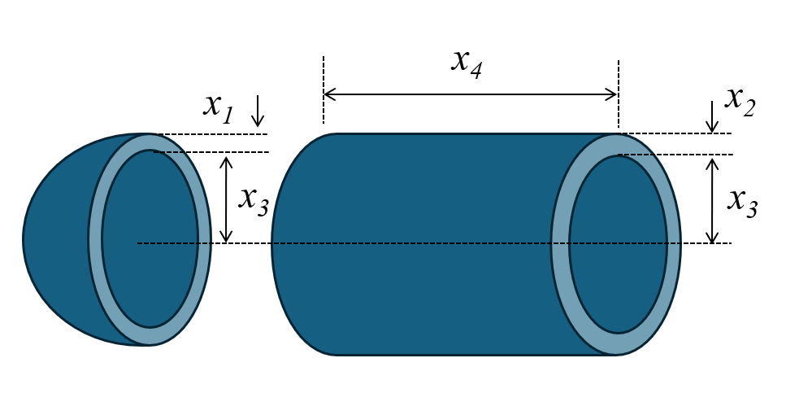

# Pressure Vessel Design Optimization

## Problem Overview

The pressure vessel design problem involves minimizing the total cost of materials, forming, and welding of a cylindrical pressure vessel with hemispherical ends. This is a well-known benchmark problem in engineering optimization that involves four design variables and four inequality constraints.

{ width="400" }

The pressure vessel consists of a cylindrical section with two hemispherical heads at both ends. The design must satisfy constraints related to material thicknesses and minimum volume requirements while minimizing the total cost.

## Objective

Minimize the total cost of the pressure vessel:

$\text{Cost} = 0.6224 x_1 x_3 x_4 + 1.7781 x_2 x_3^2 + 3.1661 x_1^2 x_4 + 19.84 x_1^2 x_3$

This cost function includes:
- Material cost for the cylindrical shell
- Material cost for the hemispherical heads
- Forming and welding costs

Where:

- $x_1$ = thickness of the head (inches)
- $x_2$ = thickness of the shell (inches)
- $x_3$ = inner radius of the vessel (inches)
- $x_4$ = length of the cylindrical section (inches)

## Design Variables

| Variable | Description | Range |
|----------|-------------|-------|
| $x_1$ | Thickness of the head | [0.0625, 10] |
| $x_2$ | Thickness of the shell | [0.0625, 10] |
| $x_3$ | Inner radius | [10, 200] |
| $x_4$ | Length of cylindrical section | [10, 240] |

## Constraints

- **Shell thickness constraint**: 

    $g_1(x) = -x_1 + 0.0193 x_3 \leq 0$
   

- **Head thickness constraint**: 

    $g_2(x) = -x_2 + 0.00954 x_3 \leq 0$
   

- **Volume constraint**: 

    $g_3(x) = -\pi x_3^2 x_4 - \frac{4}{3} \pi x_3^3 + 1,296,000 \leq 0$


- **Length constraint**: 

    $g_4(x) = x_4 - 240 \leq 0$
   
## Problem Requirements

- The vessel must have a minimum volume capacity of 1,296,000 cubic inches.
- The thicknesses $x_1$ and $x_2$ are available in discrete values that are multiples of 0.0625 inches, which is the standard thickness of rolled steel plates.
- The radii and length variables can take on any continuous values within their bounds.

## Optimal Solution

Several optimal solutions have been reported in the literature:

**Best known solution**:

- $x_1 = 0.8125$ (shell thickness)
- $x_2 = 0.4375$ (head thickness)
- $x_3 = 42.0984$ (inner radius)
- $x_4 = 176.637$ (length)
- Cost = $6,059.714$ (objective function value)

## Implementation with PyEGRO

```python
import numpy as np
from PyEGRO.optimize.GA import run_deterministic_optimization, save_optimization_results

# Objective function
def pressure_vessel_cost(X):
    X = np.atleast_2d(X)
    costs = []
    for x in X:
        x1, x2, x3, x4 = x
        cost = (
            0.6224 * x1 * x3 * x4 +
            1.7781 * x2 * x3**2 +
            3.1661 * x1**2 * x4 +
            19.84 * x1**2 * x3
        )
        costs.append(cost)
    return np.array(costs)

# Constraint functions
def g1_shell_thickness(X):
    X = np.atleast_2d(X)
    return np.array([-x[0] + 0.0193 * x[2] for x in X])

def g2_head_thickness(X):
    X = np.atleast_2d(X)
    return np.array([-x[1] + 0.00954 * x[2] for x in X])

def g3_volume(X):
    X = np.atleast_2d(X)
    return np.array([
        -np.pi * x[2]**2 * x[3] - (4.0/3.0) * np.pi * x[2]**3 + 1296000
        for x in X
    ])

def g4_length_limit(X):
    X = np.atleast_2d(X)
    return np.array([x[3] - 240 for x in X])

# Define the problem info
data_info = {
    'variables': [
        {
            'name': 'x1',
            'vars_type': 'design_vars',
            'range_bounds': [0.0625, 10],
            'description': 'Head thickness (x1)'
        },
        {
            'name': 'x2',
            'vars_type': 'design_vars',
            'range_bounds': [0.0625, 10],
            'description': 'Shell thickness (x2)'
        },
        {
            'name': 'x3',
            'vars_type': 'design_vars',
            'range_bounds': [10, 200],
            'description': 'Inner radius (x3)'
        },
        {
            'name': 'x4',
            'vars_type': 'design_vars',
            'range_bounds': [10, 240],
            'description': 'Length of cylindrical section (x4)'
        }
    ]
}

# Constraint functions
constraint_functions = [
    g1_shell_thickness,
    g2_head_thickness,
    g3_volume,
    g4_length_limit
]

# Run optimization
results = run_deterministic_optimization(
    data_info=data_info,
    true_func=pressure_vessel_cost,
    constraint_funcs=constraint_functions,
    pop_size=400,
    n_gen=100,
    sampling_method='lhs',
    crossover_prob=0.9,
    crossover_eta=15,
    mutation_eta=20
)

# Save results
save_optimization_results(
    results=results,
    data_info=data_info,
    save_dir='PRESSURE_VESSEL_RESULTS'
)

# Print best solution
print("\nOptimized Solution:")
print(f"  x1: {results['best_solution'][0]:.6f}")
print(f"  x2: {results['best_solution'][1]:.6f}")
print(f"  x3: {results['best_solution'][2]:.6f}")
print(f"  x4: {results['best_solution'][3]:.6f}")
print(f"Objective Value: {results['best_fitness']:.6f}")
print(f"Feasible: {results['is_feasible']}")
```


## References

1. Kannan, B.K., & Kramer, S.N. (1994). An augmented Lagrange multiplier based method for mixed integer discrete continuous optimization and its applications to mechanical design. Journal of Mechanical Design, 116, 405-411.
2. Coello Coello, C.A. (2000). Use of a self-adaptive penalty approach for engineering optimization problems. Computers in Industry, 41(2), 113-127.
3. He, Q., & Wang, L. (2007). An effective co-evolutionary particle swarm optimization for constrained engineering design problems. Engineering Applications of Artificial Intelligence, 20(1), 89-99.
4. Rao, S.S. (2019). Engineering Optimization: Theory and Practice. 5th Edition, John Wiley & Sons.
5. Cagnina, L. C., Esquivel, S. C., & Coello, C. A. C. (2008). Solving engineering optimization problems with the simple constrained particle swarm optimizer. Informatica, 32(3).