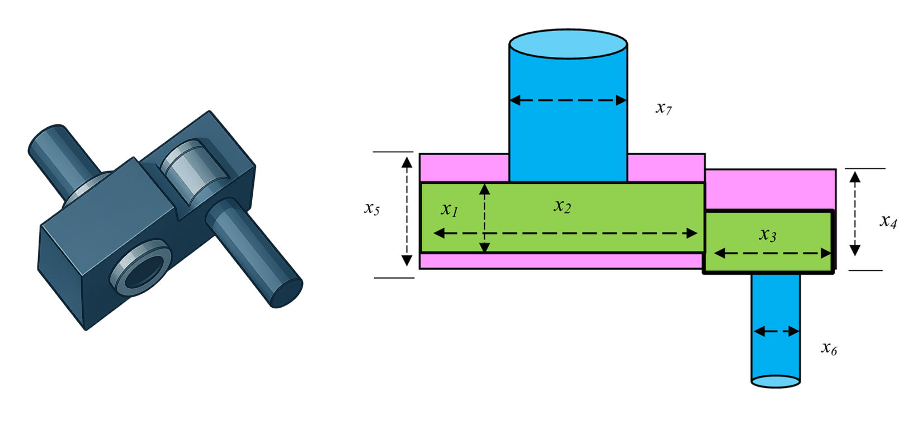
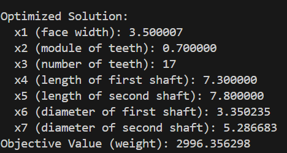

# Speed Reducer Design Optimization

## Problem Overview

The speed reducer design optimization problem involves minimizing the weight of a speed reducer subject to constraints on bending stress of the gear teeth, surface stress, transverse deflections of the shafts, and stresses in the shaft.

{ width="600" }

## Objective

Minimize the weight of the speed reducer:

$$f(\vec{x}) = 0.7854x_1x_2^2(3.3333x_3^2 + 14.9334x_3 - 43.0934) - 1.508x_1(x_6^2 + x_7^2) + 7.4777(x_6^3 + x_7^3) + 0.7854(x_4x_6^2 + x_5x_7^2)$$

## Design Variables

| Variable | Description | Range | Type |
|----------|-------------|-------|------|
| $x_1$ | Face width | [2.6, 3.6] | Continuous |
| $x_2$ | Module of teeth | [0.7, 0.8] | Continuous |
| $x_3$ | Number of teeth on pinion | [17, 28] | Integer |
| $x_4$ | Length of first shaft between bearings | [7.3, 8.3] | Continuous |
| $x_5$ | Length of second shaft between bearings | [7.8, 8.3] | Continuous |
| $x_6$ | Diameter of first shaft | [2.9, 3.9] | Continuous |
| $x_7$ | Diameter of second shaft | [5.0, 5.5] | Continuous |

## Constraints

- **Bending stress constraint**:
   
   $g_1(\vec{x}) = \frac{27}{x_1x_2^2x_3} - 1 \leq 0$

- **Surface stress constraint**:
   
   $g_2(\vec{x}) = \frac{397.5}{x_1x_2^2x_3^2} - 1 \leq 0$

- **Transverse deflection constraint (first shaft)**:
   
   $g_3(\vec{x}) = \frac{1.93x_4^3}{x_2x_3x_6^4} - 1 \leq 0$

- **Transverse deflection constraint (second shaft)**:
   
   $g_4(\vec{x}) = \frac{1.93x_5^3}{x_2x_3x_7^4} - 1 \leq 0$

- **Stress constraint (first shaft)**:
   
   $g_5(\vec{x}) = \frac{1.0}{110x_6^3}\sqrt{\left(\frac{745.0x_4}{x_2x_3}\right)^2 + 16.9 \times 10^6} - 1 \leq 0$

- **Stress constraint (second shaft)**:
   
   $g_6(\vec{x}) = \frac{1.0}{85x_7^3}\sqrt{\left(\frac{745.0x_5}{x_2x_3}\right)^2 + 157.5 \times 10^6} - 1 \leq 0$

- **Geometric constraint (pinion teeth)**:
   
   $g_7(\vec{x}) = \frac{x_2x_3}{40} - 1 \leq 0$

- **Geometric constraint (face width to module ratio)**:
   
   $g_8(\vec{x}) = \frac{5x_2}{x_1} - 1 \leq 0$

- **Geometric constraint (module to face width ratio)**:
   
   $g_9(\vec{x}) = \frac{x_1}{12x_2} - 1 \leq 0$

- **Geometric constraint (first shaft)**:
    
   $g_{10}(\vec{x}) = \frac{1.5x_6 + 1.9}{x_4} - 1 \leq 0$

- **Geometric constraint (second shaft)**:
    
   $g_{11}(\vec{x}) = \frac{1.1x_7 + 1.9}{x_5} - 1 \leq 0$

## Optimal Solution

The reported optimal solution is:

- $x_1 = 3.500000$ (face width)
- $x_2 = 0.7$ (module of teeth)
- $x_3 = 17$ (number of teeth on pinion)
- $x_4 = 7.300000$ (length of first shaft)
- $x_5 = 7.800000$ (length of second shaft)
- $x_6 = 3.350214$ (diameter of first shaft)
- $x_7 = 5.286683$ (diameter of second shaft)
- Objective value = $2,996.348165$ (minimum weight)

## Implementation with PyEGRO

```python
# =======================
# STEP 1: Define Objective function
# =======================
import numpy as np
from PyEGRO.optimize.GA import run_deterministic_optimization, save_optimization_results

def speed_reducer_weight(X):
    X = np.atleast_2d(X)
    x1, x2, x3, x4, x5, x6, x7 = X[:, 0], X[:, 1], X[:, 2], X[:, 3], X[:, 4], X[:, 5], X[:, 6]
    term1 = 0.7854 * x1 * x2**2 * (3.3333 * x3**2 + 14.9334 * x3 - 43.0934)
    term2 = -1.508 * x1 * (x6**2 + x7**2)
    term3 = 7.4777 * (x6**3 + x7**3)
    term4 = 0.7854 * (x4 * x6**2 + x5 * x7**2)
    weight = term1 + term2 + term3 + term4
    return weight

# =======================
# STEP 2: Define constraint functions
# =======================

def constraint1(X):
    X = np.atleast_2d(X)
    x1, x2, x3 = X[:, 0], X[:, 1], X[:, 2]
    g1 = 27 / (x1 * x2**2 * x3) - 1
    return g1

def constraint2(X):
    X = np.atleast_2d(X)
    x1, x2, x3 = X[:, 0], X[:, 1], X[:, 2]
    g2 = 397.5 / (x1 * x2**2 * x3**2) - 1
    return g2

def constraint3(X):
    X = np.atleast_2d(X)
    x2, x3, x4, x6 = X[:, 1], X[:, 2], X[:, 3], X[:, 5]
    g3 = 1.93 * x4**3 / (x2 * x3 * x6**4) - 1
    return g3

def constraint4(X):
    X = np.atleast_2d(X)
    x2, x3, x5, x7 = X[:, 1], X[:, 2], X[:, 4], X[:, 6]
    g4 = 1.93 * x5**3 / (x2 * x3 * x7**4) - 1
    return g4

def constraint5(X):
    X = np.atleast_2d(X)
    x2, x3, x4, x6 = X[:, 1], X[:, 2], X[:, 3], X[:, 5]
    term_inside_sqrt = (745.0 * x4 / (x2 * x3))**2 + 16.9 * 10**6
    g5 = 1.0 / (110.0 * x6**3) * np.sqrt(term_inside_sqrt) - 1
    return g5

def constraint6(X):
    X = np.atleast_2d(X)
    x2, x3, x5, x7 = X[:, 1], X[:, 2], X[:, 4], X[:, 6]
    term_inside_sqrt = (745.0 * x5 / (x2 * x3))**2 + 157.5 * 10**6
    g6 = 1.0 / (85.0 * x7**3) * np.sqrt(term_inside_sqrt) - 1
    return g6

def constraint7(X):
    X = np.atleast_2d(X)
    x2, x3 = X[:, 1], X[:, 2]
    g7 = x2 * x3 / 40.0 - 1
    return g7

def constraint8(X):
    X = np.atleast_2d(X)
    x1, x2 = X[:, 0], X[:, 1]
    g8 = 5 * x2 / x1 - 1
    return g8

def constraint9(X):
    X = np.atleast_2d(X)
    x1, x2 = X[:, 0], X[:, 1]
    g9 = x1 / (12.0 * x2) - 1
    return g9

def constraint10(X):
    X = np.atleast_2d(X)
    x4, x6 = X[:, 3], X[:, 5]
    g10 = (1.5 * x6 + 1.9) / x4 - 1
    return g10

def constraint11(X):
    X = np.atleast_2d(X)
    x5, x7 = X[:, 4], X[:, 6]
    g11 = (1.1 * x7 + 1.9) / x5 - 1
    return g11

# =======================
# STEP 3: Define the problem information
# =======================
data_info = {
    'variables': [
        {
            'name': 'x1',
            'vars_type': 'design_vars',
            'range_bounds': [2.6, 3.6],
            'description': 'Face width'
        },
        {
            'name': 'x2',
            'vars_type': 'design_vars',
            'range_bounds': [0.7, 0.8],
            'description': 'Module of teeth'
        },
        {
            'name': 'x3',
            'vars_type': 'design_vars',
            'range_bounds': [17, 28],
            'description': 'Number of teeth on pinion'
        },
        {
            'name': 'x4',
            'vars_type': 'design_vars',
            'range_bounds': [7.3, 8.3],
            'description': 'Length of first shaft between bearings'
        },
        {
            'name': 'x5',
            'vars_type': 'design_vars',
            'range_bounds': [7.8, 8.3],
            'description': 'Length of second shaft between bearings'
        },
        {
            'name': 'x6',
            'vars_type': 'design_vars',
            'range_bounds': [2.9, 3.9],
            'description': 'Diameter of first shaft'
        },
        {
            'name': 'x7',
            'vars_type': 'design_vars',
            'range_bounds': [5.0, 5.5],
            'description': 'Diameter of second shaft'
        }
    ]
}

# =======================
# STEP 4: Define the list of constraint functions
# =======================
constraint_functions = [
    constraint1,
    constraint2,
    constraint3,
    constraint4,
    constraint5,
    constraint6,
    constraint7,
    constraint8,
    constraint9,
    constraint10,
    constraint11
]

# =======================
# STEP 5: Run optimization with explicit constraints
# =======================
results = run_deterministic_optimization(
    data_info=data_info,
    true_func=speed_reducer_weight,
    constraint_funcs=constraint_functions, 
    pop_size=200,
    n_gen=200,
    sampling_method='lhs',
    crossover_prob=0.9,
    crossover_eta=15,
    mutation_eta=20
)

# =======================
# STEP 6: Save results and display solution
# =======================
save_optimization_results(
    results=results,
    data_info=data_info,
    save_dir='SPEED_REDUCER_RESULTS'
)

# Print the solution
print("\nOptimized Solution:")
print(f"  x1 (face width): {results['best_solution'][0]:.6f}")
print(f"  x2 (module of teeth): {results['best_solution'][1]:.6f}")
print(f"  x3 (number of teeth): {results['best_solution'][2]:.0f}")
print(f"  x4 (length of first shaft): {results['best_solution'][3]:.6f}")
print(f"  x5 (length of second shaft): {results['best_solution'][4]:.6f}")
print(f"  x6 (diameter of first shaft): {results['best_solution'][5]:.6f}")
print(f"  x7 (diameter of second shaft): {results['best_solution'][6]:.6f}")
print(f"Objective Value (weight): {results['best_fitness']:.6f}")
print(f"Feasible: {results['is_feasible']}")
```


{ width="300" }

## References

1. Golinski, J. (1973). An adaptive optimization system applied to machine synthesis. Mechanism and Machine Theory, 8(4), 419-436.
2. Rao, S.S. (2019). Engineering Optimization: Theory and Practice. 5th Edition, John Wiley & Sons.
3. Arora, J.S. (2012). Introduction to Optimum Design. 3rd Edition, Elsevier Academic Press.
4. Cagnina, L. C., Esquivel, S. C., & Coello, C. A. C. (2008). Solving engineering optimization problems with the simple constrained particle swarm optimizer. Informatica, 32(3).