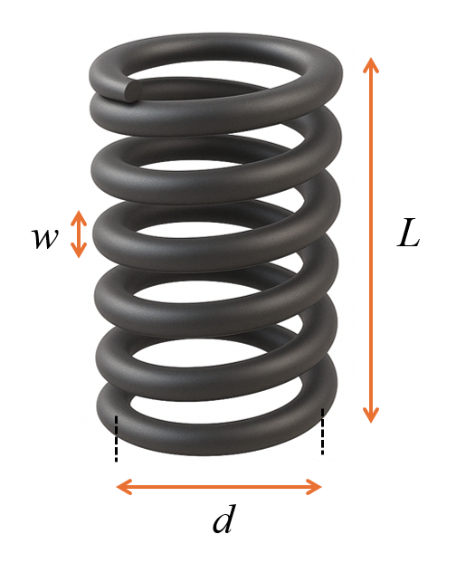

# Spring Design Optimization

## Problem Overview

Tensional and compressional springs are used widely in engineering applications. This standard optimization problem involves finding the optimal dimensions of a helical compression spring that minimizes the weight (or volume) while satisfying constraints related to deflection, stress, frequency, and geometry. [4]

{ width="300" }

## Objective

Minimize the weight of the spring:

$$f(\mathbf{x}) = (L + 2)w^2d$$

Where:

- $w$ = wire diameter
- $d$ = mean coil diameter
- $L$ = number of active coils

## Design Variables

| Variable | Description | Range | Unit |
|----------|-------------|-------|------|
| $w$ | Wire diameter | [0.05, 2.0] | inches |
| $d$ | Mean coil diameter | [0.25, 1.3] | inches |
| $L$ | Number of active coils | [2.0, 15.0] | - |

## Constraints

- **Deflection constraint**:
   
   $g_1(\mathbf{x}) = 1 - \frac{d^3L}{71785w^4} \leq 0$

- **Stress constraint**:
   
   $g_2(\mathbf{x}) = 1 - \frac{140.45w}{d^2L} \leq 0$

- **Geometric constraint (1)**:
   
   $g_3(\mathbf{x}) = \frac{2(w + d)}{3} - 1 \leq 0$

- **Frequency and stress constraint (2)**:
   
   $g_4(\mathbf{x}) = \frac{d(4d - w)}{w^3(12566d - w)} + \frac{1}{5108w^2} - 1 \leq 0$

## Optimal Solution

The reported optimal solution is:

- $w = 0.051690$ inches (wire diameter)
- $d = 0.356750$ inches (mean coil diameter)
- $L = 11.287126$ (number of active coils)
- Objective value = $0.012665$ (minimum weight)


## Implementation with PyEGRO

```python
# =======================
# STEP 1: Define Objective function
# =======================
import numpy as np
from PyEGRO.optimize.GA import run_deterministic_optimization, save_optimization_results

def spring_weight(X):
    X = np.atleast_2d(X)
    w, d, L = X[:, 0], X[:, 1], X[:, 2]
    weight = (L + 2) * w**2 * d
    return weight

# =======================
# STEP 2: Define constraint functions
# =======================

def constraint1(X):
    X = np.atleast_2d(X)
    w, d, L = X[:, 0], X[:, 1], X[:, 2]
    g1 = 1 - (d**3 * L) / (71785 * w**4)
    return g1

def constraint2(X):
    X = np.atleast_2d(X)
    w, d, L = X[:, 0], X[:, 1], X[:, 2]
    g2 = 1 - (140.45 * w) / (d**2 * L)
    return g2

def constraint3(X):
    X = np.atleast_2d(X)
    w, d, L = X[:, 0], X[:, 1], X[:, 2]
    g3 = 2 * (w + d) / 3 - 1
    return g3

def constraint4(X):
    X = np.atleast_2d(X)
    w, d, L = X[:, 0], X[:, 1], X[:, 2]
    term1_numerator = d * (4 * d - w)
    term1_denominator = w**3 * (12566 * d - w)
    safe_denominator = np.maximum(term1_denominator, 1e-10)
    term1 = term1_numerator / safe_denominator
    term1 = np.where(term1_denominator > 1e-10, term1, 1e6)
    term2 = 1 / (5108 * w**2)
    g4 = term1 + term2 - 1
    return g4

# =======================
# STEP 3: Define the problem information
# =======================
data_info = {
    'variables': [
        {
            'name': 'w',
            'vars_type': 'design_vars',
            'range_bounds': [0.05, 2.0],
            'description': 'Wire diameter (inches)'
        },
        {
            'name': 'd',
            'vars_type': 'design_vars',
            'range_bounds': [0.25, 1.3],
            'description': 'Mean coil diameter (inches)'
        },
        {
            'name': 'L',
            'vars_type': 'design_vars',
            'range_bounds': [2.0, 15.0],
            'description': 'Number of active coils'
        }
    ]
}

# =======================
# STEP 4: Define the list of constraint functions
# =======================
constraint_functions = [
    constraint1,
    constraint2,
    constraint3,
    constraint4
]

# =======================
# STEP 5: Run optimization with explicit constraints
# =======================
results = run_deterministic_optimization(
    data_info=data_info,
    true_func=spring_weight,
    constraint_funcs=constraint_functions, 
    pop_size=300,
    n_gen=150,
    sampling_method='lhs',
    crossover_prob=0.9,
    crossover_eta=15,
    mutation_eta=20
)

# =======================
# STEP 6: Save results and display solution
# =======================
save_optimization_results(
    results=results,
    data_info=data_info,
    save_dir='SPRING_DESIGN_RESULTS'
)

# Print the solution
print("\nOptimized Solution:")
print(f"  w (wire diameter): {results['best_solution'][0]:.6f} inches")
print(f"  d (mean coil diameter): {results['best_solution'][1]:.6f} inches")
print(f"  L (number of active coils): {results['best_solution'][2]:.6f}")
print(f"Objective Value (weight): {results['best_fitness']:.6f}")
print(f"Feasible: {results['is_feasible']}")
```


## References

1. Arora, J.S. (2012). Introduction to Optimum Design. 3rd Edition, Elsevier Academic Press.
2. Koziel, S., & Leifsson, L. (2013). Surrogate-based modeling and optimization. New York: Springer.
3. Rao, S.S. (2019). Engineering Optimization: Theory and Practice. 5th Edition, John Wiley & Sons.
4. Cagnina, L. C., Esquivel, S. C., & Coello, C. A. C. (2008). Solving engineering optimization problems with the simple constrained particle swarm optimizer. Informatica, 32(3).