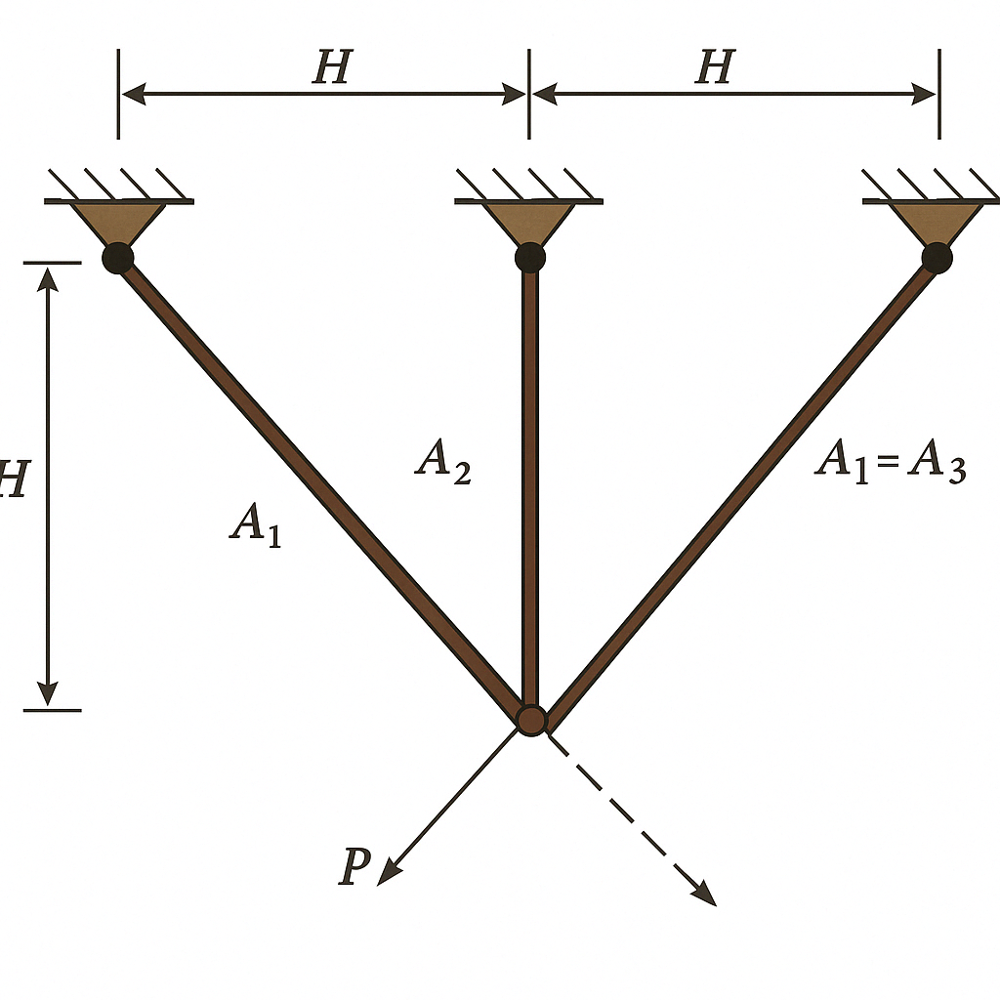

# Three-Bar Truss Design Optimization

## Problem Overview

The three-bar truss design is an engineering optimization problem with the objective to evaluate the optimal cross-sectional areas of bars in a truss structure such that the volume is minimized while satisfying stress constraints.

{ width="400" }

This problem is a classic benchmark in structural optimization and represents a simple yet practical application of optimization in civil engineering and structural design.

## Objective

Minimize the volume of the truss structure:

$$\min f(\vec{x}) = (2\sqrt{2}x_1 + x_2) \times H$$

Where:

- $x_1$ = cross-sectional area of members 1 and 3 (due to symmetry)
- $x_2$ = cross-sectional area of member 2
- $H$ = height/length parameter (typically $H = 100$ cm)

## Design Variables

| Variable | Description | Range | Unit |
|----------|-------------|-------|------|
| $x_1$ | Cross-sectional area of members 1 and 3 | [0, 1] | cm² |
| $x_2$ | Cross-sectional area of member 2 | [0, 1] | cm² |

## Constraints

**Stress constraint for member 1**:
   
   $g_1 = \frac{\sqrt{2}x_1 + x_2}{\sqrt{2}x_1^2 + 2x_1x_2}P - \sigma \leq 0$

**Stress constraint for member 2**:
   
   $g_2 = \frac{x_2}{\sqrt{2}x_1^2 + 2x_1x_2}P - \sigma \leq 0$

**Stress constraint for member 3**:
   
   $g_3 = \frac{1}{x_1 + \sqrt{2}x_2}P - \sigma \leq 0$

## Problem Constants

- Height/length parameter: $H = 100$ cm
- Applied load: $P = 2$ KN/cm²
- Allowable stress: $\sigma = 2$ KN/cm²
- Members 1 and 3 have the same cross-sectional area due to symmetry
- All members are subject to stress constraints

## Optimal Solution

The reported optimal solution is:

- $x_1 = 0.788675$ cm²
- $x_2 = 0.409841$ cm²
- Objective value = $263.8958$ cm³ (minimum volume)


## Implementation with PyEGRO

```python
# =======================
# STEP 1: Define Objective function
# =======================
import numpy as np
from PyEGRO.optimize.GA import run_deterministic_optimization, save_optimization_results

def three_bar_truss_volume(X):
    """
    Calculate the volume of the three-bar truss structure in a vectorized way.
    
    Args:
        X: Array of design points where X[:, 0] is x₁ and X[:, 1] is x₂
        
    Returns:
        Array of volumes for each design point
    """
    # Ensure X is at least 2D
    X = np.atleast_2d(X)
    
    # Height/length parameter (cm)
    H = 100
    
    # Extract x1 and x2 as vectors
    x1, x2 = X[:, 0], X[:, 1]
    
    # Volume formula: (2√2·x₁ + x₂)·H
    volume = (2 * np.sqrt(2) * x1 + x2) * H
    
    return volume

# =======================
# STEP 2: Define constraint functions
# =======================

# Problem constants
H = 100      # Height/length parameter (cm)
P = 2        # Applied load (KN/cm²)
sigma = 2    # Allowable stress (KN/cm²)

def constraint_stress1(X):
    """
    Stress constraint for member 1: g₁ = (√2x₁+x₂)/(√2x₁²+2x₁x₂)·P - σ ≤ 0
    
    Args:
        X: Array of design points where X[:, 0] is x₁ and X[:, 1] is x₂
        
    Returns:
        Array of constraint values (≤ 0 means the constraint is satisfied)
    """
    # Ensure X is at least 2D
    X = np.atleast_2d(X)
    
    # Extract x1 and x2 as vectors
    x1, x2 = X[:, 0], X[:, 1]
    
    # Calculate constraint
    numerator = np.sqrt(2) * x1 + x2
    denominator = np.sqrt(2) * x1**2 + 2 * x1 * x2
    
    # Handle potential division by zero
    safe_denominator = np.maximum(denominator, 1e-10)
    g1 = (numerator / safe_denominator) * P - sigma
    
    # Replace any invalid values with a large positive number
    g1 = np.where(denominator > 1e-10, g1, 1e6)
    
    return g1

def constraint_stress2(X):
    """
    Stress constraint for member 2: g₂ = x₂/(√2x₁²+2x₁x₂)·P - σ ≤ 0
    
    Args:
        X: Array of design points where X[:, 0] is x₁ and X[:, 1] is x₂
        
    Returns:
        Array of constraint values (≤ 0 means the constraint is satisfied)
    """
    # Ensure X is at least 2D
    X = np.atleast_2d(X)
    
    # Extract x1 and x2 as vectors
    x1, x2 = X[:, 0], X[:, 1]
    
    # Calculate constraint
    numerator = x2
    denominator = np.sqrt(2) * x1**2 + 2 * x1 * x2
    
    # Handle potential division by zero
    safe_denominator = np.maximum(denominator, 1e-10)
    g2 = (numerator / safe_denominator) * P - sigma
    
    # Replace any invalid values with a large positive number
    g2 = np.where(denominator > 1e-10, g2, 1e6)
    
    return g2

def constraint_stress3(X):
    """
    Stress constraint for member 3: g₃ = 1/(x₁+√2x₂)·P - σ ≤ 0
    
    Args:
        X: Array of design points where X[:, 0] is x₁ and X[:, 1] is x₂
        
    Returns:
        Array of constraint values (≤ 0 means the constraint is satisfied)
    """
    # Ensure X is at least 2D
    X = np.atleast_2d(X)
    
    # Extract x1 and x2 as vectors
    x1, x2 = X[:, 0], X[:, 1]
    
    # Calculate constraint
    denominator = x1 + np.sqrt(2) * x2
    
    # Handle potential division by zero
    safe_denominator = np.maximum(denominator, 1e-10)
    g3 = (1 / safe_denominator) * P - sigma
    
    # Replace any invalid values with a large positive number
    g3 = np.where(denominator > 1e-10, g3, 1e6)
    
    return g3

# =======================
# STEP 3: Define the problem information
# =======================
data_info = {
    'variables': [
        {
            'name': 'x1',
            'vars_type': 'design_vars',
            'range_bounds': [0.0, 1.0],
            'description': 'Cross-sectional area of members 1 and 3'
        },
        {
            'name': 'x2',
            'vars_type': 'design_vars',
            'range_bounds': [0.0, 1.0],
            'description': 'Cross-sectional area of member 2'
        }
    ]
}

# =======================
# STEP 4: Define the list of constraint functions
# =======================
constraint_functions = [
    constraint_stress1,
    constraint_stress2,
    constraint_stress3
]

# =======================
# STEP 5: Run optimization with explicit constraints
# =======================
results = run_deterministic_optimization(
    data_info=data_info,
    true_func=three_bar_truss_volume,
    constraint_funcs=constraint_functions, 
    pop_size=200,
    n_gen=100,
    sampling_method='lhs',
    crossover_prob=0.9,
    crossover_eta=15,
    mutation_eta=20
)

# =======================
# STEP 6: Save results and display solution
# =======================
save_optimization_results(
    results=results,
    data_info=data_info,
    save_dir='THREE_BAR_TRUSS_RESULTS'
)

# Print the solution
print("\nOptimized Solution:")
print(f"  x1 (area of members 1 and 3): {results['best_solution'][0]:.6f} cm²")
print(f"  x2 (area of member 2): {results['best_solution'][1]:.6f} cm²")
print(f"Objective Value (volume): {results['best_fitness']:.6f} cm³")
print(f"Feasible: {results['is_feasible']}")

```

## References

1. Rao, S.S. (2019). Engineering Optimization: Theory and Practice. 5th Edition, John Wiley & Sons.
2. Koziel, S., & Leifsson, L. (2013). Surrogate-based modeling and optimization. New York: Springer.
