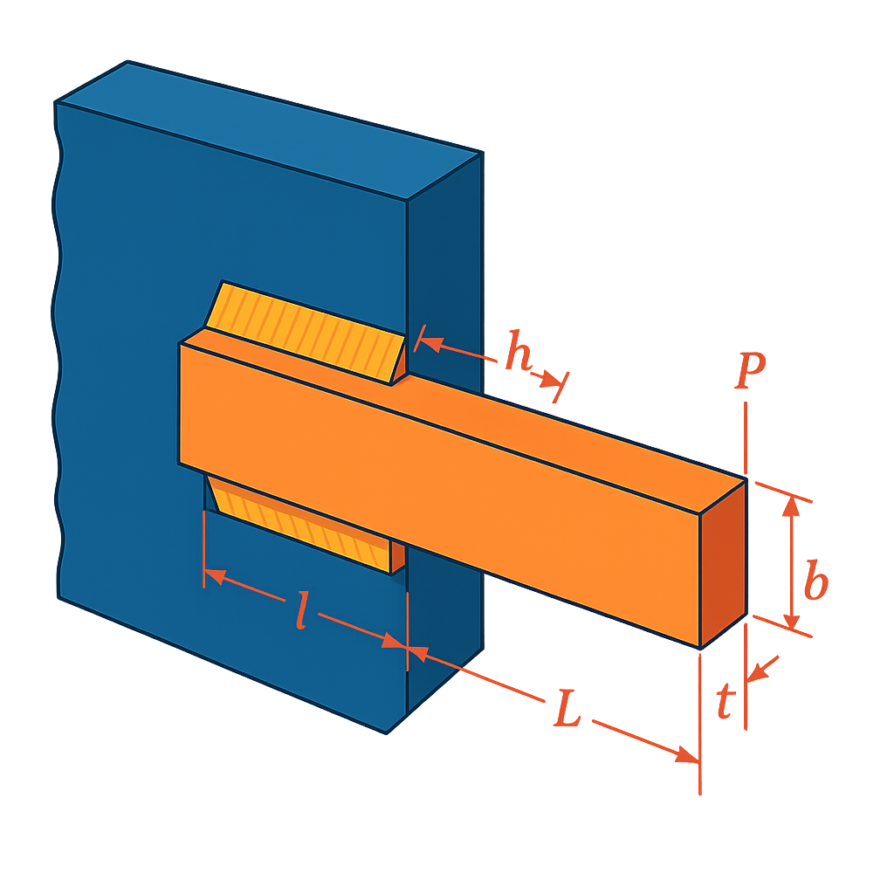

# Weld Beam Design Optimization

## Problem Overview

The weld beam design problem is a classic mechanical engineering optimization problem that involves designing a welded beam for minimum cost while satisfying various constraints related to stress, deflection, and geometry.


{ width="400" }

## Objective

Minimize the cost of the welded beam, given by:

$$\text{Cost} = 1.10471 h^2 l + 0.04811 t b (14 + l)$$

Where:
- $h$ = weld thickness
- $l$ = length of welded joint
- $t$ = width of the beam
- $b$ = thickness of the beam

## Design Variables

| Variable | Description | Range |
|----------|-------------|-------|
| $h$ | Weld thickness | [0.125, 5] |
| $l$ | Length of welded joint | [0.1, 10] |
| $t$ | Width of the beam | [0.1, 10] |
| $b$ | Thickness of the beam | [0.1, 5] |

## Constraints

- **Shear stress constraint**: $\tau \leq \tau_{max} = 13600$ psi
   
   Where $\tau$ is calculated as:
   $\tau = \sqrt{\tau_p^2 + 2\tau_p\tau_d\frac{l}{2R} + \tau_d^2}$
   $\tau_p = \frac{P}{\sqrt{2}hl}$
   $\tau_d = \frac{P(L+l/2)R}{J}$
   $R = \sqrt{\frac{l^2}{4} + \left(\frac{h+t}{2}\right)^2}$
   $J = 2 \left(\sqrt{2} \cdot h \cdot l \cdot \left(\frac{l^2}{12} + \left(\frac{h+t}{2}\right)^2\right)\right)$

- **Normal stress constraint**: $\sigma \leq \sigma_{max} = 30000$ psi
   
   Where:
   $\sigma = \frac{6PL}{bt^2}$

- **Geometric constraint**: $h \leq b$

- **Buckling load constraint**: $P \leq P_c$
   
   Where:
   $P_c = \frac{4.013E\sqrt{t^2b^6/36}}{L^2}\left(1-\frac{t}{2L}\sqrt{\frac{E}{4G}}\right)$

- **Deflection constraint**: $\delta \leq \delta_{max} = 0.25$ inches
   
   Where:
   $\delta = \frac{4PL^3}{Ebt^3}$

- **Minimum thickness constraint**: $h \geq 0.125$

## Problem Constants

- Load: $P = 6000$ lb
- Length: $L = 14$ inches
- Young's modulus: $E = 30 \times 10^6$ psi
- Shear modulus: $G = 12 \times 10^6$ psi
- Maximum shear stress: $\tau_{max} = 13600$ psi
- Maximum normal stress: $\sigma_{max} = 30000$ psi
- Maximum deflection: $\delta_{max} = 0.25$ inches

## Optimal Solution

The reported optimal solution is:
- $h = 0.205730$
- $l = 3.470489$
- $t = 9.036624$
- $b = 0.205730$
- Cost = $1.7248$ (objective function value)


## Implementation with PyEGRO

```python
"""
Welded Beam Design Problem
Example of constrained optimization using GA with PyEGRO

Objective:
    Minimize fabrication cost of a welded beam
Constraints:
    - Shear stress ≤ 13,600 psi
    - Normal stress ≤ 30,000 psi
    - Buckling, deflection, geometry, and minimum thickness
"""

import numpy as np
from PyEGRO.optimize.GA import run_deterministic_optimization, save_optimization_results

# === Problem constants ===
P = 6000         # load in lb
L = 14           # length in inches
E = 30e6         # psi
G = 12e6         # psi
tau_max = 13600
sigma_max = 30000
delta_max = 0.25

# === Objective function ===
def weld_beam_cost(X):
    X = np.atleast_2d(X)
    return np.array([
        1.10471 * h**2 * l + 0.04811 * t * b * (14 + l)
        for h, l, t, b in X
    ])

# === Constraint functions ===
def constraint_tau(X):
    results = []
    for h, l, t, b in np.atleast_2d(X):
        R = np.sqrt(l**2 / 4 + ((h + t) / 2)**2)
        J = 2 * (np.sqrt(2) * h * l * ((l**2 / 12) + ((h + t) / 2)**2))
        tau_p = P / (np.sqrt(2) * h * l)
        tau_d = (P * (L + l / 2) * R) / J
        tau = np.sqrt(tau_p**2 + 2 * tau_p * tau_d * l / (2 * R) + tau_d**2)
        results.append(tau - tau_max)
    return np.array(results)

def constraint_sigma(X):
    return np.array([
        6 * P * L / (b * t**2) - sigma_max
        for h, l, t, b in np.atleast_2d(X)
    ])

def constraint_geometry(X):
    return np.array([h - b for h, l, t, b in np.atleast_2d(X)])  # h - b <= 0

def constraint_buckling(X):
    results = []
    for h, l, t, b in np.atleast_2d(X):
        Pc = (4.013 * E * np.sqrt(t**2 * b**6 / 36)) / (L**2) * (1 - t / (2 * L) * np.sqrt(E / (4 * G)))
        results.append(P - Pc)
    return np.array(results)

def constraint_deflection(X):
    return np.array([
        4 * P * L**3 / (E * b * t**3) - delta_max
        for h, l, t, b in np.atleast_2d(X)
    ])

def constraint_thickness(X):
    return np.array([0.125 - h for h, l, t, b in np.atleast_2d(X)])

# === Define problem info ===
data_info = {
    'variables': [
        {'name': 'h', 'vars_type': 'design_vars', 'range_bounds': [0.125, 5], 'description': 'Weld thickness'},
        {'name': 'l', 'vars_type': 'design_vars', 'range_bounds': [0.1, 10], 'description': 'Length of welded joint'},
        {'name': 't', 'vars_type': 'design_vars', 'range_bounds': [0.1, 10], 'description': 'Width of the beam'},
        {'name': 'b', 'vars_type': 'design_vars', 'range_bounds': [0.1, 5], 'description': 'Thickness of the beam'}
    ]
}

# === List of constraint functions ===
constraint_functions = [
    constraint_tau,
    constraint_sigma,
    constraint_geometry,
    constraint_buckling,
    constraint_deflection,
    constraint_thickness
]

# === Run optimization ===
results = run_deterministic_optimization(
    data_info=data_info,
    true_func=weld_beam_cost,
    constraint_funcs=constraint_functions,
    pop_size=600,
    n_gen=100,
    sampling_method='lhs',
    crossover_prob=0.9,
    crossover_eta=15,
    mutation_eta=20
)

# === Save results ===
save_optimization_results(
    results=results,
    data_info=data_info,
    save_dir='WELD_BEAM_DIRECT_CONSTRAINED'
)

# === Print result ===
print("\nOptimized Solution:")
h, l, t, b = results['best_solution']
print(f"  h: {h:.6f}")
print(f"  l: {l:.6f}")
print(f"  t: {t:.6f}")
print(f"  b: {b:.6f}")
print(f"Objective Value: {results['best_fitness']:.6f}")
print(f"Feasible: {results['is_feasible']}")

```


## References

1. Rao, S.S. (2019). Engineering Optimization: Theory and Practice. 5th Edition, John Wiley & Sons.
2. Deb, K. (2000). An efficient constraint handling method for genetic algorithms. Computer Methods in Applied Mechanics and Engineering, 186(2-4), 311-338.
3. Coello Coello, C.A. (2000). Use of a self-adaptive penalty approach for engineering optimization problems. Computers in Industry, 41(2), 113-127.
4. Cagnina, L. C., Esquivel, S. C., & Coello, C. A. C. (2008). Solving engineering optimization problems with the simple constrained particle swarm optimizer. Informatica, 32(3).
