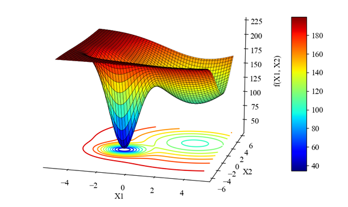
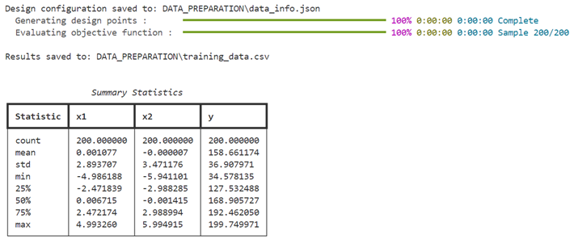

# Basics Surrogate Model Training Examples

---




### **Objective Function**

The Gaussian-shaped test function is defined as:

$$
    f(X_1, X_2) = - \left[ A_1 \cdot \exp \left( - \left( \frac{(X_1 - \mu_1)^2}{2 \sigma_1^2} + \frac{(X_2 - \mu_2)^2}{2 \sigma_2^2} \right) \right) +
    A_2 \cdot \exp \left( - \left( \frac{(X_1 - \mu_3)^2}{2 \sigma_3^2} + \frac{(X_2 - \mu_4)^2}{2 \sigma_4^2} \right) \right) \right] - 200
$$

Where:

- \(A_1, A_2\): Amplitudes of the Gaussian peaks.  

- \(\mu_1, \mu_2, \mu_3, \mu_4\): Centers of the peaks.  

- \(\sigma_1, \sigma_2, \sigma_3, \sigma_4\): Standard deviations controlling the spread of the peaks.  

---

## Constants
The constants for the Gaussian peaks are defined as follows:

- \(A_1 = 100, A_2 = 150\)  

- \(\mu_1 = 3, \mu_2 = 2.1, \mu_3 = -1.5, \mu_4 = -1.2\)  

- \(\sigma_1 = 3, \sigma_2 = 3, \sigma_3 = 1, \sigma_4 = 1\)  

---

## Deterministic Optimal Points
The deterministic solution yields the following minima in the design variables \(X_1\) and \(X_2\) from the ranges \([-5, 5]\) and \([-6, 6]\):

**Global Minimum:**

   - Function Value: \(f(X_1, X_2) = -31.85\)  

   - At \((X_1, X_2) = (-1.44, -1.16)\)  

**Local Minimum:**

   - Function Value: \(f(X_1, X_2) = -100\)  

   - At \((X_1, X_2) = (3.0, 2.10)\)  

---

This setup allows the function to test optimization algorithms for their ability to handle varying sensitivities across both global and local optima, as demonstrated by the deterministic solutions. The response surface across the entire design variable range is visualized in the Figure.


## **1. Define the Test Function**

To define the Gaussian-shaped test function, create a separate Python file named `objective.py`:

**File: objective.py**
```python
import numpy as np

def true_function(x):
    X1, X2 = x[:, 0], x[:, 1]
    a1, x1, y1, sigma_x1, sigma_y1 = 100, 3, 2.1, 3, 3
    a2, x2, y2, sigma_x2, sigma_y2 = 150, -1.5, -1.2, 1, 1
    f = -(
        a1 * np.exp(-((X1 - x1) ** 2 / (2 * sigma_x1 ** 2) + (X2 - y1) ** 2 / (2 * sigma_y1 ** 2))) +
        a2 * np.exp(-((X1 - x2) ** 2 / (2 * sigma_x2 ** 2) + (X2 - y2) ** 2 / (2 * sigma_y2 ** 2))) - 200
    )

    return f
```

This function represents two Gaussian peaks, one for the global minimum and another for the local minimum.

---

## **2. Generate Design Samples**

**Steps Explained**:

1. **Define Variables:** Add design variables `x1` and `x2` with their respective bounds and covariance values.

2. **Save Configuration:** Save the configuration for reproducibility.

3. **Run Sampling:** Generate 200 samples using the defined test function.


To generate initial design samples using LHS, create a file named `run_initial_design.py`:

**File: run_initial_design.py**
```python
from PyEGRO.doe.initial_design import InitialDesign
from objective import true_function

# Create design with LHS sampling
design_lhs = InitialDesign(
    sampling_method="lhs",
    show_progress=True
)

# Add design variables
design_lhs.add_design_variable(
    name='x1',
    range_bounds=[-5, 5],
    cov=0.2,
    description='first design variable'
)

design_lhs.add_design_variable(
    name='x2',
    range_bounds=[-6, 6],
    cov=0.15,
    description='second design variable'
)

# Save configuration
design_lhs.save()

# Run sampling
results_lhs = design_lhs.run(
    objective_function=true_function,
    num_samples=200
)
```

**Output**

- Command line Displays



- Save Output Directory **`DATA_PREPARATION`**


---

## **3. Train the Surrogate Model**

**Steps Explained**:

1. **Initialize MetaTraining:** Set up the training configuration and preprocessing options.

2. **Train Model:** Train the Gaussian Process Regression (GPR) surrogate model using the sampled data.

3. **Save Results:** Save the trained model and data scalers for future use.


Use the generated design samples to train the surrogate model. Below is an example script for surrogate model training:

**File: train_surrogate.py**
```python
from PyEGRO.meta.meta_trainer import MetaTraining

# Initialize MetaTraining
meta = MetaTraining()

# Train surrogate model
model, scaler_X, scaler_y = meta.train()

# Save trained model and scalers
meta.save()
```

---

**Output**

- Command line Displays


- Save Output Directory **`RESULT_MODEL_GPR`**


- Performance plot example


---


