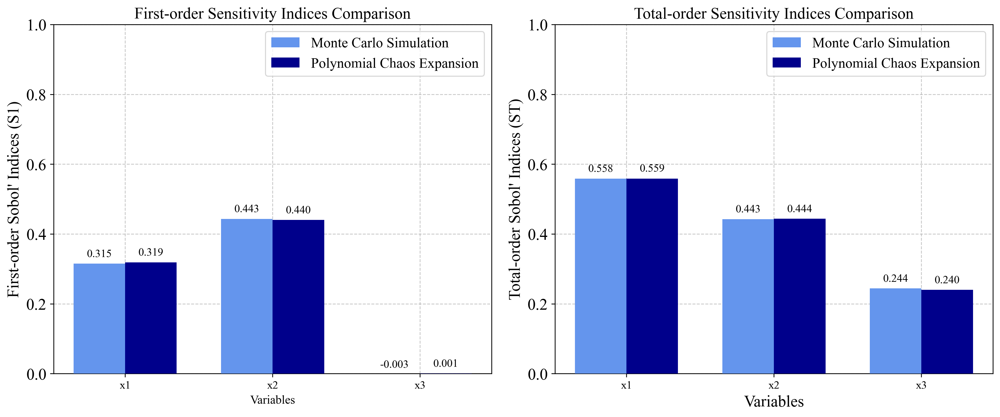
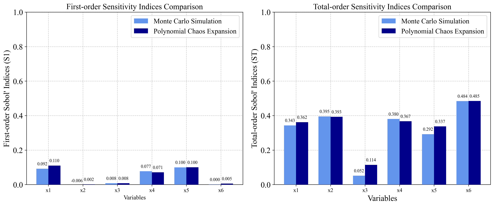

# Sensitivity Analysis Benchmarking with PyEGRO

This document demonstrates the implementation of benchmark functions for sensitivity analysis using the PyEGRO library. The theoretical values are based on the paper: **[1] Azzini, I., & Rosati, R. (2022). A function dataset for benchmarking in sensitivity analysis. *Data in Brief*, *42*, 108071.**

## 1. Introduction

Sensitivity analysis helps identify how different input variables affect model outputs. The PyEGRO library provides tools to perform sensitivity analysis on various functions. In this benchmarking, we'll implement three well-known test functions:

1. Ishigami function
2. Hartmann 6-D function
3. A1 function (k-function)

We'll compare our computed sensitivity indices with the analytical values provided in the literature using two different methods:
- Monte Carlo simulation (MCS)
- Polynomial Chaos Expansion (PCE)

## 2. Theoretical Values

### 2.1 Ishigami Function

**Formula**:
$f(X) = \sin(x_1) + 7 \cdot \sin^2(x_2) + 0.1 \cdot x_3^4 \cdot \sin(x_1)$

**Analytical Sensitivity Indices**:

First-order indices (Si):
- `S₁ = 0.3138, S₂ = 0.4413, S₃ = 0`

Total-order indices (STi):
- `ST₁ = 0.5575889, ST₂ = 0.4424111, ST₃ = 0.2436837`


### 2.2 Hartmann 6-D Function

**Formula**:
$f(X) = -\sum_{j=1}^{4} \alpha_j \exp(-\sum_{k=1}^{6} A_{j,k}(x_k - P_{j,k})^2)$

With:
- alpha = [1.0, 1.2, 3.0, 3.2]
- A = [10, 3, 17, 3.50, 1.7, 8; 0.05, 10, 17, 0.1, 8, 14; 3, 3.5, 1.7, 10, 17, 8; 17, 8, 0.05, 10, 0.1, 14]
- P = 10⁻⁴ × [1312, 1696, 5569, 124, 8283, 5886; 2329, 4135, 8307, 3736, 1004, 9991; 2348, 1451, 3522, 2883, 3047, 6650; 4047, 8828, 8732, 5743, 1091, 381]

**Analytical Sensitivity Indices**:

First-order indices (Si):
- `S₁ = 0.115, S₂ = 0.00699, S₃ = 0.00715, S₄ = 0.0888, S₅ = 0.109, S₆ = 0.0139`

Total-order indices (STi):
- `ST₁ = 0.344, ST₂ = 0.398, ST₃ = 0.0515, ST₄ = 0.381, ST₅ = 0.297, ST₆ = 0.482`

### 2.3 A1 Function (k-function)

**Formula**: 
$f(X) = \sum_{j=1}^{k} (-1)^j \cdot \prod_{i=1}^j x_i$

**Analytical Sensitivity Indices (n = 10)**:

First-order indices (Si):
- `S₁ = 0.67, S₂ = 0.17, S₃ = 0.041, S₄ = 0.01, S₅ = 0.0025, S₆ = 0.00069, S₇ = 0.00014, S₈ = 0.000051, S₉ = S₁₀ = 0.0000057`

Total-order indices (STi):
- `ST₁ = 0.75, ST₂ = 0.25, ST₃ = 0.083, ST₄ = 0.028, ST₅ = 0.0092, ST₆ = 0.0032, ST₇ = 0.00093, ST₈ = 0.00042, ST₉ = ST₁₀ = 0.000076`


## 3. Implementation with PyEGRO

### 3.1 Ishigami Function Implementation

#### 3.1.1 Monte Carlo Simulation Approach

```python
import numpy as np
import matplotlib.pyplot as plt
import seaborn as sns
from PyEGRO.sensitivity.SAmcs import run_sensitivity_analysis
import json
import os

# Define the Ishigami function
def ishigami_function(X):

    a = 7
    b = 0.1
    
    x1 = X[:, 0]
    x2 = X[:, 1]
    x3 = X[:, 2]
    
    return np.sin(x1) + a * np.sin(x2)**2 + b * x3**4 * np.sin(x1)

# Define data_info with variable definitions
data_info = {
    'variables': [
        {
            'name': 'x1',
            'vars_type': 'design_vars',
            'distribution': 'uniform',
            'range_bounds': [-np.pi, np.pi],
            'description': 'First input variable'
        },
        {
            'name': 'x2',
            'vars_type': 'design_vars',
            'distribution': 'uniform',
            'range_bounds': [-np.pi, np.pi],
            'description': 'Second input variable'
        },
        {
            'name': 'x3',
            'vars_type': 'design_vars',
            'distribution': 'uniform',
            'range_bounds': [-np.pi, np.pi],
            'description': 'Third input variable'
        }
    ]
}

# Save data_info to a JSON file
os.makedirs("DATA_PREPARATION", exist_ok=True)
with open("DATA_PREPARATION/data_info.json", 'w') as f:
    json.dump(data_info, f)

# Run the analysis
results_df = run_sensitivity_analysis(
    data_info_path="DATA_PREPARATION/data_info.json",
    true_func=ishigami_function,
    num_samples=2**10,  # Increased sample size for better accuracy
    output_dir="RESULT_SA_ISHIGAMI",
    random_seed=42,
    show_progress=True
)

# Display and compare results with theoretical values
print("Ishigami Function Sensitivity Analysis Results (Monte Carlo):")
print(results_df)
```

#### 3.1.2 Polynomial Chaos Expansion Approach

```python
###===============================
# Using Polynomial Chaos Expansion
###===============================

from PyEGRO.sensitivity.SApce import run_sensitivity_analysis

# Run the analysis
results_df_pce = run_sensitivity_analysis(
    data_info_path="DATA_PREPARATION/data_info.json",
    true_func=ishigami_function,
    polynomial_order=5,
    num_samples=500,
    output_dir="RESULT_SA_ISHIGAMI_PCE",
    show_progress=True
)

```

{ width="800" }


### 3.2 Hartmann 6-D Function Implementation

#### 3.2.1 Monte Carlo Simulation Approach

```python
import numpy as np
from PyEGRO.sensitivity.SAmcs import run_sensitivity_analysis
import json
import os

# Define the Hartmann 6-D function
def hartmann_6d_function(X):

    alpha = np.array([1.0, 1.2, 3.0, 3.2])
    
    A = np.array([
        [10, 3, 17, 3.5, 1.7, 8],
        [0.05, 10, 17, 0.1, 8, 14],
        [3, 3.5, 1.7, 10, 17, 8],
        [17, 8, 0.05, 10, 0.1, 14]
    ])
    
    P = 1e-4 * np.array([
        [1312, 1696, 5569, 124, 8283, 5886],
        [2329, 4135, 8307, 3736, 1004, 9991],
        [2348, 1451, 3522, 2883, 3047, 6650],
        [4047, 8828, 8732, 5743, 1091, 381]
    ])
    
    n_samples = X.shape[0]
    result = np.zeros(n_samples)
    
    for i in range(n_samples):
        outer_sum = 0
        for j in range(4):
            inner_sum = 0
            for k in range(6):
                inner_sum += A[j, k] * (X[i, k] - P[j, k])**2
            outer_sum += alpha[j] * np.exp(-inner_sum)
        result[i] = -outer_sum
    
    return result

# Define data_info with variable definitions for Hartmann function
data_info = {
    'variables': [
        {'name': f'x{i+1}', 
         'vars_type': 'design_vars', 
         'distribution': 'uniform', 
         'range_bounds': [0, 1], 
         'description': f'Input variable {i+1}'} 
        for i in range(6)
    ]
}

# Save data_info to a JSON file
os.makedirs("DATA_PREPARATION", exist_ok=True)
with open("DATA_PREPARATION/data_info_hartmann.json", 'w') as f:
    json.dump(data_info, f)

# Run the analysis
results_df = run_sensitivity_analysis(
    data_info_path="DATA_PREPARATION/data_info_hartmann.json",
    true_func=hartmann_6d_function,
    num_samples=2**14,  # Higher sample size for 6D function
    output_dir="RESULT_SA_HARTMANN",
    show_progress=True
)
```

#### 3.2.2 Polynomial Chaos Expansion Approach

```python
###===============================
# Using Polynomial Chaos Expansion
###===============================

from PyEGRO.sensitivity.SApce import run_sensitivity_analysis

# Run the analysis with PCE
results_df_pce = run_sensitivity_analysis(
    data_info_path="DATA_PREPARATION/data_info_hartmann.json",
    true_func=hartmann_6d_function,
    polynomial_order=4,  
    num_samples=1000,   
    output_dir="RESULT_SA_HARTMANN_PCE",
    show_progress=True
)

# Run PCE analysis for the Hartmann 6-D function
```

{ width="800" }

### 3.3 A1 Function (k-function) Implementation

#### 3.3.1 Monte Carlo Simulation Approach

```python
import numpy as np
from PyEGRO.sensitivity.SAmcs import run_sensitivity_analysis
import json
import os

# Define the A1 function (k-function)
def a1_function(X):

    n_samples = X.shape[0]
    n_vars = X.shape[1]
    result = np.zeros(n_samples)
    
    for i in range(n_samples):
        sample_result = 0
        for j in range(1, n_vars + 1):
            term = (-1)**j
            for k in range(j):
                term *= X[i, k]
            sample_result += term
        result[i] = sample_result
    
    return result

# Define data_info with variable definitions for A1 function (k-function)
data_info = {
    'variables': [
        {'name': f'x{i+1}', 
         'vars_type': 'design_vars', 
         'distribution': 'uniform', 
         'range_bounds': [0, 1], 
         'description': f'Input variable {i+1}'} 
        for i in range(10)  # n = 10 as specified in the paper
    ]
}

# Save data_info to a JSON file
os.makedirs("DATA_PREPARATION", exist_ok=True)
with open("DATA_PREPARATION/data_info_a1.json", 'w') as f:
    json.dump(data_info, f)

# Run the analysis
results_df = run_sensitivity_analysis(
    data_info_path="DATA_PREPARATION/data_info_a1.json",
    true_func=a1_function,
    num_samples=2**16,  
    output_dir="RESULT_SA_A1",
    random_seed=42,
    show_progress=True
)
```

{ width="800" }


## 4. Comparison of MCS and PCE 

The two methods used in this analysis have different characteristics:

### 4.1 Monte Carlo Simulation (MCS)
- **Pros**: 
  - Robust for any type of model
  - Can handle non-linear, non-monotonic relationships
  - Convergence is independent of problem dimension
- **Cons**:
  - Computationally expensive, requiring many model evaluations
  - Convergence rate is relatively slow (proportional to 1/√N)

### 4.2 Polynomial Chaos Expansion (PCE)
- **Pros**:
  - More efficient for smooth functions
  - Requires fewer model evaluations
  - Provides analytical sensitivity indices from the polynomial representation
  - Better convergence rates for low-dimensional smooth problems
- **Cons**:
  - Performance degrades in high dimensions (curse of dimensionality)
  - Less suitable for highly non-linear or discontinuous functions
  - Requires selection of polynomial order


## References

1. Azzini, I., & Rosati, R. (2022). A function dataset for benchmarking in sensitivity analysis. *Data in Brief*, *42*, 108071.
2. Sobol, I.M. (2001). Global sensitivity indices for nonlinear mathematical models and their Monte Carlo estimates. *Mathematics and Computers in Simulation*, *55*(1-3), 271-280.
3. Saltelli, A., Ratto, M., Andres, T., Campolongo, F., Cariboni, J., Gatelli, D., Saisana, M., & Tarantola, S. (2008). *Global Sensitivity Analysis: The Primer*. John Wiley & Sons.
4. Sudret, B. (2008). Global sensitivity analysis using polynomial chaos expansions. *Reliability Engineering & System Safety*, *93*(7), 964-979.