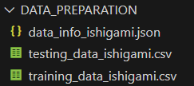
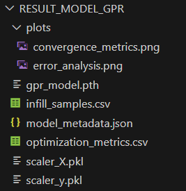
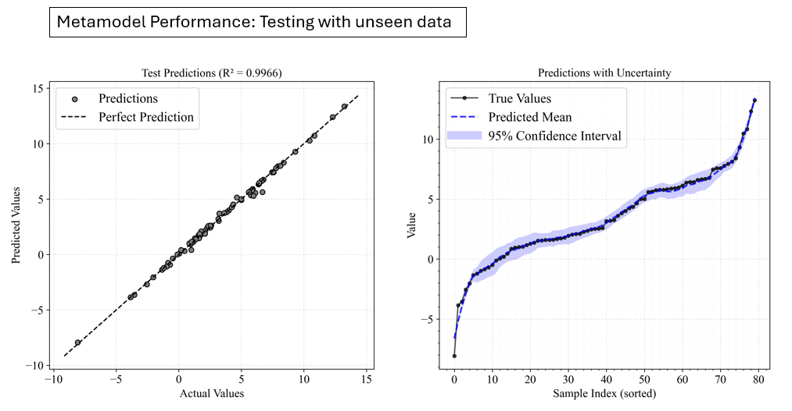

# Metamodel-Based Sensitivity Analysis Benchmarking

This document demonstrates the implementation of benchmark functions for sensitivity analysis using metamodels with the PyEGRO library, comparing with the analytical benchmarks presented in the previous document.

## 1. Introduction

For computationally expensive models, using a metamodel (surrogate model) can significantly reduce the computational cost of sensitivity analysis. In this benchmarking, we'll implement the same three well-known test functions using Gaussian Process Regression (GPR) metamodels:

1. Ishigami function
2. Hartmann 6-D function

Instead of directly computing sensitivity indices from the original functions, we'll first train a metamodel on a limited number of samples, then use the trained metamodel for sensitivity analysis.

## 2. Metamodel with PyEGRO

### 2.1 Ishigami Function Implementation

#### 2.1.1 Generate Training and Testing Data

```python
from PyEGRO.doe.initial_design import InitialDesign
import numpy as np

# ==================================================
# Create Objective Function
# ==================================================

def ishigami_function(X):
    """Ishigami function implementation"""
    a = 7
    b = 0.1
    
    # Extract single sample or first sample from batch
    if X.ndim > 1:
        x1 = X[:, 0]
        x2 = X[:, 1]
        x3 = X[:, 2]
    else:
        x1 = X[0]
        x2 = X[1]
        x3 = X[2]
    
    return np.sin(x1) + a * np.sin(x2)**2 + b * x3**4 * np.sin(x1)


# ==================================================
# Create training data set
# ==================================================


sampling_training = InitialDesign(
    sampling_method='lhs',  # Latin Hypercube Sampling
    results_filename='training_data_ishigami',
    show_progress=True
)
   
# Add design variables
sampling_training.add_design_variable(
    name='x1',
    range_bounds=[-np.pi, np.pi],
    distribution='uniform',
    description='First input variable'
)

sampling_training.add_design_variable(
    name='x2',
    range_bounds=[-np.pi, np.pi],
    distribution='uniform',
    description='Second input variable'
)

sampling_training.add_design_variable(
    name='x3',
    range_bounds=[-np.pi, np.pi],
    distribution='uniform',
    description='Third input variable'
)

# Save the design configuration
sampling_training.save('data_info_ishigami')

# Generate samples and evaluate the function
training_results = sampling_training.run(
    objective_function=ishigami_function,
    num_samples=200  # Number of training samples
)


# ==================================================
# Create testing data set for model validation
# ==================================================

sampling_testing = InitialDesign(
    sampling_method='lhs',
    results_filename='testing_data_ishigami',
    show_progress=True
)

# Add design variables
sampling_testing.add_design_variable(
    name='x1',
    range_bounds=[-np.pi, np.pi],
    distribution='uniform',
    description='First input variable'
)

sampling_testing.add_design_variable(
    name='x2',
    range_bounds=[-np.pi, np.pi],
    distribution='uniform',
    description='Second input variable'
)

sampling_testing.add_design_variable(
    name='x3',
    range_bounds=[-np.pi, np.pi],
    distribution='uniform',
    description='Third input variable'
)

# Generate testing samples
testing_results = sampling_testing.run(
    objective_function=ishigami_function,
    num_samples=80  # Number of testing samples
)
```

The experiment data will be saved as speration file in the folder:

{ width="250" }


#### 2.1.2 Train Gaussian Process Regression (GPR) Metamodel using Efficient Global Optimization (EGO) 

```python
# =====================================================
# Training metamodel with EGO 
# =====================================================


import json
import numpy as np
import pandas as pd
from PyEGRO.meta.egogpr import EfficientGlobalOptimization, TrainingConfig


# Load initial data and problem configuration
with open('DATA_PREPARATION/data_info_ishigami.json', 'r') as f:
    data_info = json.load(f)

initial_data = pd.read_csv('DATA_PREPARATION/training_data_ishigami.csv')
bounds = np.array(data_info['input_bound'])
variable_names = [var['name'] for var in data_info['variables']]

# Configure the optimization with custom kernel and learning parameters
config = TrainingConfig(
    training_iter = 10000,
    early_stopping_patience = 20,
    max_iterations = 500,           # Maximum infill samples
    rmse_threshold = 0.001,
    relative_improvement = 0.01,    # 1% of relative improve
    rmse_patience = 20,
    acquisition_name="eigf",
    kernel="matern25",              # Use v = 2.5 for smoother predictions
    learning_rate=0.01              # Lower learning rate for more stable convergence
)

# Initialize and run optimization
ego = EfficientGlobalOptimization(
    objective_func=ishigami_function,
    bounds=bounds,
    variable_names=variable_names,
    config=config,
    initial_data=initial_data
)

# Run optimization
history = ego.run()


# ======================================================
# Testing a Trained model
# ======================================================

from PyEGRO.meta.evaluation import modeltesting

# Test GPR model
results_gpr = modeltesting.load_and_test_model(
    data_path="DATA_PREPARATION/testing_data_ishigami.csv",
    model_dir="RESULT_MODEL_GPR",
    model_name="gpr_model",
    output_dir="test_results",
    show_plots=False,
    smooth_window=11
    
)

```
The result of infill samples and the trained model will be saved in the folder:

{ width="250" }

Model performance evaluation:

{ width="1000" }


#### 2.1.3 Sensitivity Analysis Using the Metamodel

```python
# ======================================================
# Sensitivity Analysis
# ======================================================

from PyEGRO.sensitivity.SAmcs import run_sensitivity_analysis
from PyEGRO.meta.gpr.gpr_utils import DeviceAgnosticGPR
# Load model and run sensitivity analysis
model_handler = DeviceAgnosticGPR(prefer_gpu=True)
model_handler.load_model('RESULT_MODEL_GPR')

results_df = run_sensitivity_analysis(
    data_info_path="DATA_PREPARATION/data_info_ishigami.json",
    model_handler=model_handler,
    num_samples=2**14,
    output_dir="RESULT_SA_METAMODEL_ISHIGAMI",
    show_progress=True
)

```

{ width="1000" }


### 2.2 Hartmann 6-D Function Implementation

#### 2.2.1 Generate Training and Testing Data

```python
from PyEGRO.doe.initial_design import InitialDesign
import numpy as np

# ==================================================
# Create Objective Function
# ==================================================

def hartmann_6d_function(X):
    """
    Hartmann 6-D function - benchmark for sensitivity analysis.
    """
    alpha = np.array([1.0, 1.2, 3.0, 3.2])
    
    A = np.array([
        [10, 3, 17, 3.5, 1.7, 8],
        [0.05, 10, 17, 0.1, 8, 14],
        [3, 3.5, 1.7, 10, 17, 8],
        [17, 8, 0.05, 10, 0.1, 14]
    ])
    
    P = 1e-4 * np.array([
        [1312, 1696, 5569, 124, 8283, 5886],
        [2329, 4135, 8307, 3736, 1004, 9991],
        [2348, 1451, 3522, 2883, 3047, 6650],
        [4047, 8828, 8732, 5743, 1091, 381]
    ])
    
    # Handle single sample or batch of samples
    if X.ndim == 1:
        X = X.reshape(1, -1)
    
    n_samples = X.shape[0]
    result = np.zeros(n_samples)
    
    for i in range(n_samples):
        outer_sum = 0
        for j in range(4):
            inner_sum = 0
            for k in range(6):
                inner_sum += A[j, k] * (X[i, k] - P[j, k])**2
            outer_sum += alpha[j] * np.exp(-inner_sum)
        result[i] = -outer_sum
    
    return result


# ==================================================
# Create training data set
# ==================================================


sampling_training = InitialDesign(
    sampling_method='lhs',
    results_filename='training_data_hartmann',
    show_progress=True
)
   

for i in range(6):
    sampling_training.add_design_variable(
        name=f'x{i+1}',
        range_bounds=[0, 1],
        distribution='uniform',
        description=f'Input variable {i+1}'
    )


sampling_training.save('data_info_hartmann')

training_results = sampling_training.run(
    objective_function=hartmann_6d_function,
    num_samples=1000  
)


# ==================================================
# Create testing data set for model validation
# ==================================================

sampling_training = InitialDesign(
    sampling_method='lhs',
    results_filename='testing_data_hartmann',
    show_progress=True
)
   
for i in range(6):
    sampling_training.add_design_variable(
        name=f'x{i+1}',
        range_bounds=[0, 1],
        distribution='uniform',
        description=f'Input variable {i+1}'
    )

training_results = sampling_training.run(
    objective_function=hartmann_6d_function,
    num_samples=300
)

```

#### 2.2.2 Train Metamodel (Large data available without using EGO) + Sensitivity Analysis

```python
import pandas as pd
import json
import numpy as np
from PyEGRO.meta.gpr import MetaTraining
from PyEGRO.sensitivity.SAmcs import run_sensitivity_analysis
from PyEGRO.meta.gpr.gpr_utils import DeviceAgnosticGPR

# Load and prepare data
with open('DATA_PREPARATION/data_info_hartmann.json', 'r') as f:
    data_info = json.load(f)

training_data = pd.read_csv('DATA_PREPARATION/training_data_hartmann.csv')
test_data = pd.read_csv('DATA_PREPARATION/testing_data_hartmann.csv')

variable_names = [var['name'] for var in data_info['variables']]
target_column = 'y'

X_train = training_data[variable_names].values
y_train = training_data[target_column].values.reshape(-1, 1)
X_test = test_data[variable_names].values
y_test = test_data[target_column].values.reshape(-1, 1)

# Train GPR model
meta = MetaTraining(
    num_iterations=10000,
    prefer_gpu=True,
    show_progress=True,
    output_dir='RESULT_MODEL_GPR_HARTMANN',
    kernel='matern25',
    learning_rate=0.01,
    patience=50
)

model, scaler_X, scaler_y = meta.train(
    X=X_train,
    y=y_train,
    X_test=X_test,
    y_test=y_test,
    feature_names=variable_names
)

# Load model and run sensitivity analysis
model_handler = DeviceAgnosticGPR(prefer_gpu=True)
model_handler.load_model('RESULT_MODEL_GPR_HARTMANN')

results_df = run_sensitivity_analysis(
    data_info_path="DATA_PREPARATION/data_info_hartmann.json",
    model_handler=model_handler,
    num_samples=2**14,
    output_dir="RESULT_SA_METAMODEL_HARTMANN",
    show_progress=True
)
```

{ width="1000" }


## 3. Conclusion

Metamodel-based sensitivity analysis provides a powerful approach for analyzing computationally expensive models. 

The key advantages include:

1. **Computational Efficiency**: Only a limited number of original function evaluations are needed
2. **Flexibility**: Works with various types of models, including black-box functions
3. **Scalability**: Makes sensitivity analysis feasible for complex simulation models


## References

1. Azzini, I., & Rosati, R. (2022). A function dataset for benchmarking in sensitivity analysis. *Data in Brief*, *42*, 108071.
2. Rasmussen, C.E., & Williams, C.K.I. (2006). *Gaussian Processes for Machine Learning*. MIT Press.
3. Gratiet, L.L., Marelli, S., & Sudret, B. (2017). Metamodel-based sensitivity analysis: Polynomial chaos expansions and Gaussian processes. *Handbook of Uncertainty Quantification*, 1289-1325.