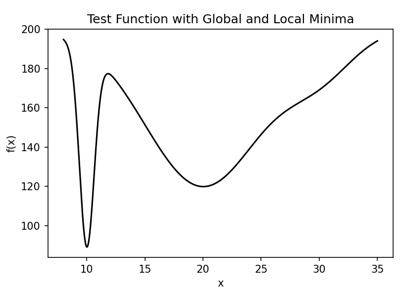
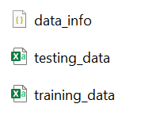
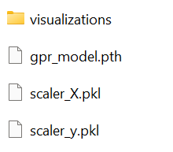
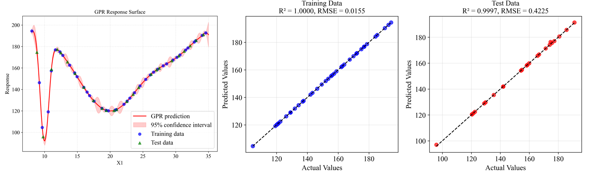
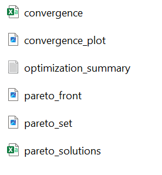
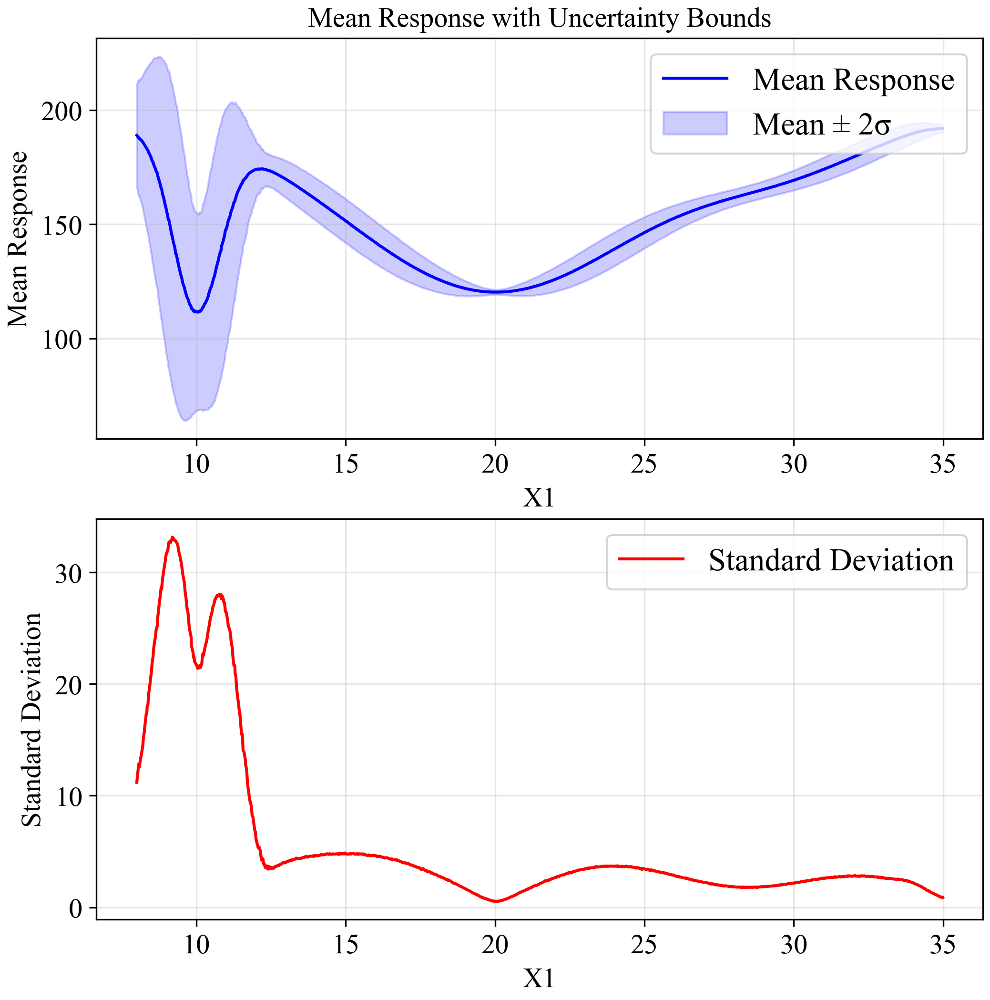
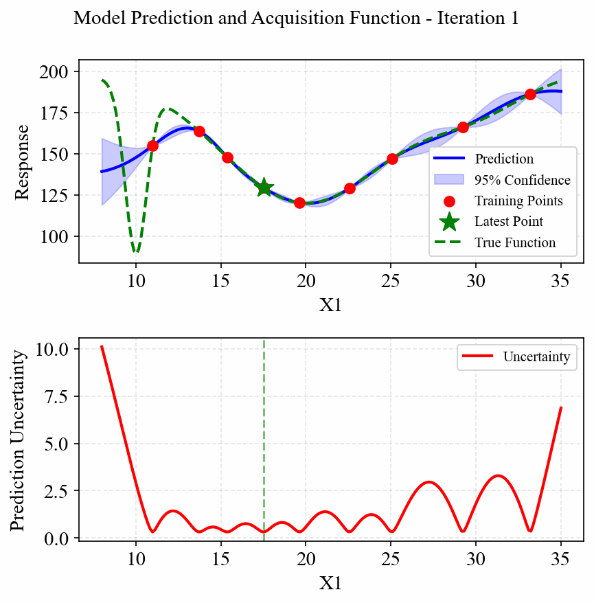

# Quick Start Guide

This guide demonstrates how to use PyEGRO to solve an optimization problem under uncertainty. We'll walk through a complete workflow that includes sampling, metamodel, and robust optimization.

## The Problem: Multi-modal Function Optimization

Let's start with a mathematical definition of our problem. We'll use a one-dimensional multi-modal function with multiple local minima:

$$f(x) = -\left(100 \cdot e^{-\frac{(x-10)^2}{0.8}} + 80 \cdot e^{-\frac{(x-20)^2}{50}} + 20 \cdot e^{-\frac{(x-30)^2}{18}} - 200 \right)$$

This function has three distinct peaks centered at $x=10$, $x=20$, and $x=30$, each with different heights and widths:
- The peak at $x=10$ is tall and narrow
- The peak at $x=20$ is medium height and wide
- The peak at $x=30$ is short and medium width

The global minimum is near $x=10$, but in the presence of uncertainty, the robust optimum might be different.

{ width="500" }

Our goal is to find the robust optimum of this function when there is uncertainty in the input variable $x$. We'll model this uncertainty as a normal distribution with a standard deviation of 0.5.

## Step 1: Define the Test Function

First, let's implement our multi-modal test function:

```python
import numpy as np
import matplotlib.pyplot as plt

def multimodal_peaks(X):
    """
    Multi-modal test function with multiple local minima.
    
    f(x) = -(100*exp(-(x-10)²/0.8) + 80*exp(-(x-20)²/50) + 20*exp(-(x-30)²/18) - 200)
    
    Has distinct peaks at x=10, x=20, and x=30 with different widths.
    """
    x = X[:, 0]
    term1 = 100 * np.exp(-((x - 10)**2) / 0.8)
    term2 = 80 * np.exp(-((x - 20)**2) / 50)
    term3 = 20 * np.exp(-((x - 30)**2) / 18)
    
    return -(term1 + term2 + term3 - 200)

# Optional: visualize the function
x_range = np.linspace(8, 35, 1000).reshape(-1, 1)
y_values = multimodal_peaks(x_range)

plt.figure(figsize=(10, 6))
plt.plot(x_range, y_values)
plt.title('Multi-modal Function with Multiple Local Minima')
plt.xlabel('x')
plt.ylabel('f(x)')
plt.savefig('multimodal_function.png', dpi=300)
plt.show()
```

## Step 2: Create Initial Design Samples

Now, let's create initial sampling points for training and testing our metamodel:

```python
from PyEGRO.doe.initial_design import InitialDesign

# Create training data set
sampling_training = InitialDesign(
    sampling_method='lhs',  # Latin Hypercube Sampling
    results_filename='training_data',
    show_progress=True
)
   
# Add design variable with uncertainty
sampling_training.add_design_variable(
    name='X1',
    range_bounds=[8, 35],  # Search range
    std=0.5,               # Standard deviation for uncertainty
    distribution='normal', # Normal distribution for uncertainty
    description='X1'
)

# Save the design configuration
sampling_training.save('data_info')

# Generate samples and evaluate the function
training_results = sampling_training.run(
    objective_function=multimodal_peaks,
    num_samples=40
)

# Create testing data set for model validation
sampling_testing = InitialDesign(
    sampling_method='lhs',
    results_filename='testing_data',
    show_progress=True
)

sampling_testing.add_design_variable(
    name='X1',
    range_bounds=[8, 35],
    std=0.5,
    distribution='normal',
    description='X1'
)
   
testing_results = sampling_testing.run(
    objective_function=multimodal_peaks,
    num_samples=25
)
```

Result of experiment data will be saved as these files:

{ width="150" }

## Step 3: Train a Metamodel

Now we'll train a Gaussian Process Regression (Kriging) model on our sampled data:

```python
import pandas as pd
import json
from PyEGRO.meta.gpr import MetaTraining
from PyEGRO.meta.gpr.visualization import visualize_gpr

# Load initial data and problem configuration
with open('DATA_PREPARATION/data_info.json', 'r') as f:
    data_info = json.load(f)

# Load training and testing data
training_data = pd.read_csv('DATA_PREPARATION/training_data.csv')
test_data = pd.read_csv('DATA_PREPARATION/testing_data.csv')

# Get problem configuration
bounds = np.array(data_info['input_bound'])
variable_names = [var['name'] for var in data_info['variables']]
target_column = data_info.get('target_column', 'y')

# Extract features and targets
X_train = training_data[variable_names].values
y_train = training_data[target_column].values.reshape(-1, 1)
X_test = test_data[variable_names].values
y_test = test_data[target_column].values.reshape(-1, 1)

# Initialize and train GPR model
print("Training GPR model...")
meta = MetaTraining(
    num_iterations=1000,
    prefer_gpu=True,           # Use GPU if available
    show_progress=True,
    output_dir='RESULT_MODEL_GPR',
    kernel='matern25',         # Matérn kernel with ν=2.5
    learning_rate=0.01,
    patience=50                # Early stopping patience
)

# Train the model
model, scaler_X, scaler_y = meta.train(
    X=X_train,
    y=y_train,
    X_test=X_test,
    y_test=y_test,
    feature_names=variable_names
)

# Generate visualization of the surrogate model
figures = visualize_gpr(
    meta=meta,
    X_train=X_train,
    y_train=y_train,
    X_test=X_test,
    y_test=y_test,
    variable_names=variable_names,
    bounds=bounds,
    savefig=True
)
```

The training result will be saved in the following files:

{ width="150" }

The metamodel trained on the sampled data accurately captures the behavior of the original function, including all the peaks and their relative heights. The figure below shows the model's performance with training points (blue circles) and test points (green triangles):

{ width="850" }

The model demonstrates excellent accuracy with R² = 0.9997 on the test data and RMSE = 0.4225, indicating a very good fit to the underlying function.

## Step 4: Perform Robust Optimization

Finally, we'll use the trained surrogate model to find the robust optimum using Monte Carlo Simulation (MCS):

```python
from PyEGRO.meta.gpr import gpr_utils
from PyEGRO.robustopt.method_mcs import run_robust_optimization, save_optimization_results

# Load problem definition
with open('DATA_PREPARATION/data_info.json', 'r') as f:
    data_info = json.load(f)

# Initialize GPR handler to use the trained model
gpr_handler = gpr_utils.DeviceAgnosticGPR(prefer_gpu=True)
gpr_handler.load_model('RESULT_MODEL_GPR')

# Run robust optimization using the surrogate model
print("Running robust optimization...")
results = run_robust_optimization(
    model_handler=gpr_handler,
    data_info=data_info,
    mcs_samples=10000,         # Number of Monte Carlo samples
    pop_size=25,               # Population size for multi-objective optimization
    n_gen=100,                 # Number of generations
    metric='hv'                # Hypervolume metric for convergence
)

# Save optimization results
save_optimization_results(
    results=results,
    data_info=data_info,
    save_dir='MCS_RESULT_GPR'
)

# Display Pareto front
import matplotlib.pyplot as plt

pareto_front = results['pareto_front']
plt.figure(figsize=(10, 6))
plt.scatter(pareto_front[:, 0], pareto_front[:, 1], c='blue', s=50)
plt.xlabel('Mean')
plt.ylabel('Standard Deviation')
plt.title('Pareto Front: Mean vs. Standard Deviation')
plt.grid(True)
plt.savefig('pareto_front.png', dpi=300)
plt.show()

print("Robust optimization complete!")
```

## Results

The robust optimization provides a Pareto front of solutions that balance the mean performance and robustness (low standard deviation). From this front, you can select a solution based on your preference for performance versus robustness.

{ width="800" }

Result folder:

{ width="150" }

Looking at the Pareto front and the final solutions, we can observe two distinct regions:

1. **Solution A (around x=10)**: This solution offers the best mean performance (lowest function value) but has higher uncertainty (standard deviation). This is because the peak at x=10 is very narrow, so small variations in x can lead to large changes in the output.

2. **Solution B (around x=20)**: This solution has slightly worse mean performance but much better robustness (lower standard deviation). The peak at x=20 is wider, making the function less sensitive to variations in x.

This trade-off is clearly visible in the convergence history and final Pareto front, where we have two distinct clusters of solutions. A decision maker would need to choose between better performance (Solution A) or better robustness (Solution B) based on their specific requirements.

## Optional Extensions

### 1. Uncertainty Quantification

You can further analyze the uncertainty propagation at specific points:

```python
from PyEGRO.meta.gpr import gpr_utils
from PyEGRO.uncertainty.UQmcs import UncertaintyPropagation

# Initialize the GPR handler
model_handler = gpr_utils.DeviceAgnosticGPR(prefer_gpu=True)
model_handler.load_model('RESULT_MODEL_GPR')

# Create UncertaintyPropagation instance
propagation = UncertaintyPropagation(
    data_info_path='DATA_PREPARATION/data_info.json',
    model_handler=model_handler,
    output_dir='UQ_GPR',
    show_variables_info=True,
    use_gpu=True
)

# Run the analysis
results = propagation.run_analysis(
    num_design_samples=1000,
    num_mcs_samples=10000,
    show_progress=True
)
```

The uncertainty quantification analysis clearly shows how the uncertainty in the input variable propagates through the model:

{ width="400" }

The upper plot shows the mean response (blue line) with a ±2σ confidence band (light blue region). The lower plot shows the standard deviation across the input space. Notice how the standard deviation increases dramatically around x=10, confirming our observation about the sensitivity of this region to small variations in input.

### 2. Efficient Global Optimization (EGO)

To improve the metamodel accuracy, you can use EGO to adaptively add samples where they're most needed:

```python
import json
import numpy as np
import pandas as pd
from PyEGRO.meta.egogpr import EfficientGlobalOptimization, TrainingConfig

# Load initial data and problem configuration
with open('DATA_PREPARATION/data_info.json', 'r') as f:
    data_info = json.load(f)

initial_data = pd.read_csv('DATA_PREPARATION/training_data.csv')
bounds = np.array(data_info['input_bound'])
variable_names = [var['name'] for var in data_info['variables']]

# Configure the optimization
config = TrainingConfig(
    training_iter=10000,
    early_stopping_patience=20,
    max_iterations=20,
    rmse_threshold=0.001,
    relative_improvement=0.01,  # 1% of relative improvement
    rmse_patience=10,
    acquisition_name="cri3",    # CRI3 acquisition function
    kernel="matern15",          # Matérn kernel with ν=1.5
    learning_rate=0.01          # Learning rate for training
)

# Initialize and run optimization
ego = EfficientGlobalOptimization(
    objective_func=multimodal_peaks,
    bounds=bounds,
    variable_names=variable_names,
    config=config,
    initial_data=initial_data
)

# Run optimization
history = ego.run()
```

The following animation shows how the EGO algorithm adaptively adds sampling points to improve the model's accuracy, particularly in regions with high uncertainty or sharp changes in the response:

{ width="400" }

Initially, EGO struggles to capture the narrow peak at x=10, but as it adds more points in this region, the model becomes increasingly accurate. The CRI3 acquisition function effectively balances exploration (sampling in areas of high uncertainty) and exploitation (refining the model in areas of interest).

## Summary

This quick start guide demonstrated a complete workflow using PyEGRO for robust optimization:

1. Problem definition with mathematical context
2. Initial sampling using Latin Hypercube Sampling (LHS)
3. Metamodel training with Gaussian Process Regression (GPR)
4. Robust optimization using Monte Carlo Simulation (MCS)
5. Optional extensions for uncertainty quantification and efficient global optimization

With this workflow, you can find robust solutions to your own optimization problems, even when dealing with uncertainty in the input variables. 

The key insight from this example is that the **global optimum (at x=10) may not be the most robust solution** when uncertainties are considered - **a more robust solution exists at x=20**, which sacrifices some performance for significantly lower sensitivity to input variations.