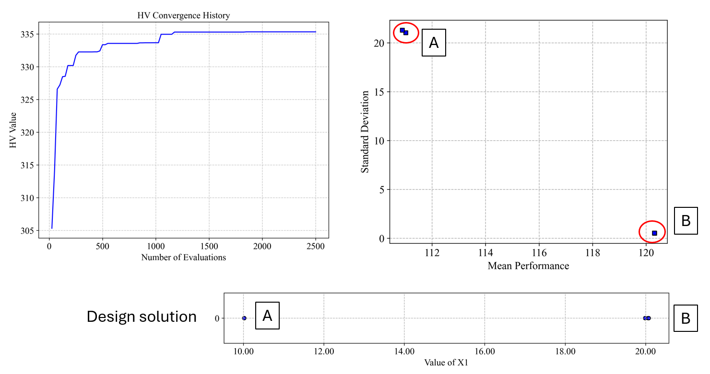

# Quick Start Guide

This guide demonstrates how to use PyEGRO to solve an optimization problem under uncertainty. We'll walk through a complete workflow that includes sampling, metamodel, and robust optimization.

## The Problem: Multi-modal Function Optimization

Let's start with a mathematical definition of our problem. We'll use a one-dimensional multi-modal function with multiple local minima:

$$f(x) = -\left(100 \cdot e^{-\frac{(x-10)^2}{0.8}} + 80 \cdot e^{-\frac{(x-20)^2}{50}} + 20 \cdot e^{-\frac{(x-30)^2}{18}} - 200 \right)$$

This function has three distinct peaks centered at $x=10$, $x=20$, and $x=30$, each with different heights and widths:
- The peak at $x=10$ is tall and narrow
- The peak at $x=20$ is medium height and wide
- The peak at $x=30$ is short and medium width

The global minimum is near $x=10$, but in the presence of uncertainty, the robust optimum might be different.

{ width="500" }

Our goal is to find the robust optimum of this function when there is uncertainty in the input variable $x$. We'll model this uncertainty as a normal distribution with a standard deviation of 0.5.

## Step 1: Define the Test Function

First, let's implement our multi-modal test function:

```python
import numpy as np
import matplotlib.pyplot as plt

def multimodal_peaks(X):
    """
    Multi-modal test function with multiple local minima.
    
    f(x) = -(100*exp(-(x-10)²/0.8) + 80*exp(-(x-20)²/50) + 20*exp(-(x-30)²/18) - 200)
    
    Has distinct peaks at x=10, x=20, and x=30 with different widths.
    """
    x = X[:, 0]
    term1 = 100 * np.exp(-((x - 10)**2) / 0.8)
    term2 = 80 * np.exp(-((x - 20)**2) / 50)
    term3 = 20 * np.exp(-((x - 30)**2) / 18)
    
    return -(term1 + term2 + term3 - 200)

# Optional: visualize the function
x_range = np.linspace(8, 35, 1000).reshape(-1, 1)
y_values = multimodal_peaks(x_range)

plt.figure(figsize=(10, 6))
plt.plot(x_range, y_values)
plt.title('Multi-modal Function with Multiple Local Minima')
plt.xlabel('x')
plt.ylabel('f(x)')
plt.savefig('multimodal_function.png', dpi=300)
plt.show()
```

## Step 2: Create Initial Design Samples

Now, let's create initial sampling points for training and testing our metamodel:

```python
from PyEGRO.doe.initial_design import InitialDesign

# Create training data set
sampling_training = InitialDesign(
    sampling_method='lhs',  # Latin Hypercube Sampling
    results_filename='training_data',
    show_progress=True
)
   
# Add design variable with uncertainty
sampling_training.add_design_variable(
    name='X1',
    range_bounds=[8, 35],  # Search range
    std=0.5,               # Standard deviation for uncertainty
    distribution='normal', # Normal distribution for uncertainty
    description='X1'
)

# Save the design configuration
sampling_training.save('data_info')

# Generate samples and evaluate the function
training_results = sampling_training.run(
    objective_function=multimodal_peaks,
    num_samples=40
)

# Create testing data set for model validation
sampling_testing = InitialDesign(
    sampling_method='lhs',
    results_filename='testing_data',
    show_progress=True
)

sampling_testing.add_design_variable(
    name='X1',
    range_bounds=[8, 35],
    std=0.5,
    distribution='normal',
    description='X1'
)
   
testing_results = sampling_testing.run(
    objective_function=multimodal_peaks,
    num_samples=25
)
```

Result of experiment data will be saved as these files:

{ width="150" }

## Step 3: Train a Metamodel

Now we'll train a Gaussian Process Regression (Kriging) model on our sampled data:

```python
import pandas as pd
import json
from PyEGRO.meta.gpr import MetaTraining
from PyEGRO.meta.gpr.visualization import visualize_gpr

# Load initial data and problem configuration
with open('DATA_PREPARATION/data_info.json', 'r') as f:
    data_info = json.load(f)

# Load training and testing data
training_data = pd.read_csv('DATA_PREPARATION/training_data.csv')
test_data = pd.read_csv('DATA_PREPARATION/testing_data.csv')

# Get problem configuration
bounds = np.array(data_info['input_bound'])
variable_names = [var['name'] for var in data_info['variables']]
target_column = data_info.get('target_column', 'y')

# Extract features and targets
X_train = training_data[variable_names].values
y_train = training_data[target_column].values.reshape(-1, 1)
X_test = test_data[variable_names].values
y_test = test_data[target_column].values.reshape(-1, 1)

# Initialize and train GPR model
print("Training GPR model...")
meta = MetaTraining(
    num_iterations=1000,
    prefer_gpu=True,           # Use GPU if available
    show_progress=True,
    output_dir='RESULT_MODEL_GPR',
    kernel='matern25',         # Matérn kernel with ν=2.5
    learning_rate=0.01,
    patience=50                # Early stopping patience
)

# Train the model
model, scaler_X, scaler_y = meta.train(
    X=X_train,
    y=y_train,
    X_test=X_test,
    y_test=y_test,
    feature_names=variable_names
)

# Generate visualization of the surrogate model
figures = visualize_gpr(
    meta=meta,
    X_train=X_train,
    y_train=y_train,
    X_test=X_test,
    y_test=y_test,
    variable_names=variable_names,
    bounds=bounds,
    savefig=True
)
```

The training result will be saved in the following files:

{ width="150" }

The metamodel trained on the sampled data accurately captures the behavior of the original function, including all the peaks and their relative heights. The figure below shows the model's performance with training points (blue circles) and test points (green triangles):

{ width="850" }

The model demonstrates excellent accuracy with R² = 0.9997 on the test data and RMSE = 0.4225, indicating a very good fit to the underlying function.

## Step 4: Perform Robust Optimization

Finally, we'll use the trained surrogate model to find the robust optimum using Monte Carlo Simulation (MCS):

```python
from PyEGRO.meta.gpr import gpr_utils
from PyEGRO.robustopt.method_mcs import run_robust_optimization, save_optimization_results

# Load problem definition
with open('DATA_PREPARATION/data_info.json', 'r') as f:
    data_info = json.load(f)

# Initialize GPR handler to use the trained model
gpr_handler = gpr_utils.DeviceAgnosticGPR(prefer_gpu=True)
gpr_handler.load_model('RESULT_MODEL_GPR')

# Run robust optimization using the surrogate model
print("Running robust optimization...")
results = run_robust_optimization(
    model_handler=gpr_handler,
    data_info=data_info,
    mcs_samples=10000,         # Number of Monte Carlo samples
    pop_size=25,               # Population size for multi-objective optimization
    n_gen=100,                 # Number of generations
    metric='hv'                # Hypervolume metric for convergence
)

# Save optimization results
save_optimization_results(
    results=results,
    data_info=data_info,
    save_dir='MCS_RESULT_GPR'
)

# Display Pareto front
import matplotlib.pyplot as plt

pareto_front = results['pareto_front']
plt.figure(figsize=(10, 6))
plt.scatter(pareto_front[:, 0], pareto_front[:, 1], c='blue', s=50)
plt.xlabel('Mean')
plt.ylabel('Standard Deviation')
plt.title('Pareto Front: Mean vs. Standard Deviation')
plt.grid(True)
plt.savefig('pareto_front.png', dpi=300)
plt.show()

print("Robust optimization complete!")
```

## Results

The robust optimization provides a Pareto front of solutions that balance the mean performance and robustness (low standard deviation). From this front, you can select a solution based on your preference for performance versus robustness.

{ width="800" }

Result folder:

{ width="150" }


## Step 5: Perform Robustness Result Analysis

After identifying the potential robust solutions from the Pareto front, we need to analyze them in detail to understand their reliability and performance characteristics under uncertainty. We'll separately analyze the two key solutions we identified: 

> <span style="color:blue">**Solution B (x=20)**</span> which appears more robust.

> <span style="color:blue">**Solution A (x=10)**</span> which has better mean performance


### Solution B (x=20): 

First, let's analyze the robustness characteristics of the solution at x=20:

```python
#===============================================================================
# Analysis of Solution B (X = 20) - The More Robust Solution
#===============================================================================

import numpy as np
from PyEGRO.uncertainty.UQmcs import UncertaintyPropagation
from PyEGRO.meta.gpr import gpr_utils

# Load a pre-trained surrogate model
model_handler = gpr_utils.DeviceAgnosticGPR(prefer_gpu=True)
model_handler.load_model('RESULT_MODEL_GPR')

# Create UncertaintyPropagation instance with the surrogate model for X=20
uq_study_x20 = UncertaintyPropagation(
    data_info_path="DATA_PREPARATION/data_info.json",
    model_handler=model_handler,
    output_dir="RESULT_UQ_ANALYSIS_X20",
    show_variables_info=True
)

# Analyze the point at x=20 (robust solution)
robust_point = {'X1': 20.0}
robust_result = uq_study_x20.analyze_specific_point(
    design_point=robust_point,
    num_mcs_samples=100000,
    create_pdf=True,
    create_reliability=True
)

# Print summary statistics for the robust solution
print("\nRobust Solution (X = 20) Statistics:")
print(f"Mean: {robust_result['statistics']['mean']:.4f}")
print(f"Std Dev: {robust_result['statistics']['std']:.4f}")
print(f"CoV: {robust_result['statistics']['cov']:.4f}")
print(f"95% CI: [{robust_result['statistics']['percentiles']['2.5']:.4f}, "
      f"{robust_result['statistics']['percentiles']['97.5']:.4f}]")

# Calculate reliability index manually
threshold = 130.0
reliability_index = (threshold - robust_result['statistics']['mean']) / robust_result['statistics']['std']
print(f"Reliability index for threshold {threshold}: {reliability_index:.4f}")
```

{ width="1000" }

The analysis for Solution B (x=20) shows:

- **Mean response**: 120.31
- **Standard deviation**: 0.54
- **Coefficient of variation (CoV)**: 0.0045 (very low, indicating high robustness)
- **95% Confidence Interval**: [119.92, 121.84] (narrow band)

The PDF (left) shows a tight distribution with little spread, indicating high reliability. The Probability of Failure Curve (right) shows:

- 95% probability of response being below 121.39
- 50% probability of response being below 120.11
- Very steep Probability of Failure Curve indicates predictable performance

The **reliability index** for a threshold of `130.0` would be approximately `17.95`

### Solution A (x=10): 

Now, let's analyze the solution at x=10 separately:

```python
#===============================================================================
# Analysis of Solution A (X = 10) - The Better Mean Performance Solution
#===============================================================================

# Create a separate UncertaintyPropagation instance for X=10
uq_study_x10 = UncertaintyPropagation(
    data_info_path="DATA_PREPARATION/data_info.json",
    model_handler=model_handler,
    output_dir="RESULT_UQ_ANALYSIS_X10",
    show_variables_info=True
)

# Analyze the point at x=10 (better mean performance solution)
optimal_point = {'X1': 10.0}
optimal_result = uq_study_x10.analyze_specific_point(
    design_point=optimal_point,
    num_mcs_samples=100000,
    create_pdf=True,
    create_reliability=True
)

# Print summary statistics for the optimal solution
print("\nOptimal Solution (X = 10) Statistics:")
print(f"Mean: {optimal_result['statistics']['mean']:.4f}")
print(f"Std Dev: {optimal_result['statistics']['std']:.4f}")
print(f"CoV: {optimal_result['statistics']['cov']:.4f}")
print(f"95% CI: [{optimal_result['statistics']['percentiles']['2.5']:.4f}, "
      f"{optimal_result['statistics']['percentiles']['97.5']:.4f}]")

# Calculate reliability index manually using the same threshold
threshold = 130.0
reliability_index = (threshold - optimal_result['statistics']['mean']) / optimal_result['statistics']['std']
print(f"Reliability index for threshold {threshold}: {reliability_index:.4f}")
```

{ width="1000" }

The analysis for Solution A (x=10) shows:

- **Mean response**: 110.49 (better than Solution B)
- **Standard deviation**: 22.35 (much higher than Solution B)
- **Coefficient of variation (CoV)**: 0.2023 (44.9 times higher than Solution B)
- **95% Confidence Interval**: [89.18, 167.08] (very wide band)

The PDF (left) shows a wide, spread-out distribution, indicating high variability. The Probability of Failure Curve (right) shows:

- 95% probability of response being below 158.76
- 50% probability of response being below 102.39
- Shallow Probability of Failure Curve indicates unpredictable performance

The reliability index for a threshold of 130.0 would be approximately 0.87, indicating relatively low reliability compared to Solution B.

### Comparative Analysis

The results clearly demonstrate the trade-off between optimality and robustness:

## Solution Comparison

<table style="width: 100%; border-collapse: collapse; border-radius: 8px; overflow: hidden; box-shadow: 0 4px 8px rgba(0,0,0,0.1);">
  <thead>
    <tr style="background-color: #3a506b; color: white; text-align: left;">
      <th style="padding: 12px 15px; border-top-left-radius: 8px;">Metric</th>
      <th style="padding: 12px 15px; text-align: center;">Solution A<br/><span style="font-weight: normal; font-size: 0.9em;">(x=10)</span></th>
      <th style="padding: 12px 15px; text-align: center;">Solution B<br/><span style="font-weight: normal; font-size: 0.9em;">(x=20)</span></th>
      <th style="padding: 12px 15px; border-top-right-radius: 8px;">Comparison</th>
    </tr>
  </thead>
  <tbody>
    <tr style="background-color: #f8f9fa;">
      <td style="padding: 12px 15px; font-weight: 500;">Mean Response</td>
      <td style="padding: 12px 15px; text-align: center; color: #2e7d32; font-weight: bold;">110.49</td>
      <td style="padding: 12px 15px; text-align: center;">120.31</td>
      <td style="padding: 12px 15px;"><span style="color: #2e7d32; font-weight: 500;">Solution A is 8.2% better</span></td>
    </tr>
    <tr style="background-color: white;">
      <td style="padding: 12px 15px; font-weight: 500;">Standard Deviation</td>
      <td style="padding: 12px 15px; text-align: center;">22.35</td>
      <td style="padding: 12px 15px; text-align: center; color: #1565c0; font-weight: bold;">0.54</td>
      <td style="padding: 12px 15px;"><span style="color: #1565c0; font-weight: 500;">Solution B is 41.4× more stable</span></td>
    </tr>
    <tr style="background-color: #f8f9fa;">
      <td style="padding: 12px 15px; font-weight: 500;">Coefficient of Variation (CoV)</td>
      <td style="padding: 12px 15px; text-align: center;">0.2023</td>
      <td style="padding: 12px 15px; text-align: center; color: #1565c0; font-weight: bold;">0.0045</td>
      <td style="padding: 12px 15px;"><span style="color: #1565c0; font-weight: 500;">Solution B is 44.9× more robust</span></td>
    </tr>
    <tr style="background-color: white;">
      <td style="padding: 12px 15px; font-weight: 500;">95% CI Width</td>
      <td style="padding: 12px 15px; text-align: center;">77.90</td>
      <td style="padding: 12px 15px; text-align: center; color: #1565c0; font-weight: bold;">1.92</td>
      <td style="padding: 12px 15px;"><span style="color: #1565c0; font-weight: 500;">Solution B has 40.6× narrower confidence band</span></td>
    </tr>
    <tr style="background-color: #f8f9fa;">
      <td style="padding: 12px 15px; font-weight: 500;">Reliability Index (β)<br/><span style="font-weight: normal; font-size: 0.85em;">(threshold = 130.0)</span></td>
      <td style="padding: 12px 15px; text-align: center;">0.87</td>
      <td style="padding: 12px 15px; text-align: center; color: #1565c0; font-weight: bold;">17.95</td>
      <td style="padding: 12px 15px;"><span style="color: #1565c0; font-weight: 500;">Solution B is far more reliable</span></td>
    </tr>
  </tbody>
</table>

> **Common interpretation:** β > 3: Highly reliable | 2 < β < 3: Reliable | 1 < β < 2: Moderately reliable | β < 1: Less reliable

### Understanding Reliability Index

The reliability index (β) is a measure used in reliability engineering to quantify how far the mean response is from a critical threshold in terms of standard deviations:

β = (Threshold - Mean) / StdDev

- A **positive β** means the mean is below the threshold (desirable if we want to stay below the threshold)
- A **negative β** means the mean is above the threshold
- A **larger absolute value** of β indicates greater reliability


For Solution B (x=20), the reliability index of 17.95 indicates virtually zero probability of exceeding the threshold of 130.0, whereas Solution A (x=10) with a reliability index of 0.87 has a non-negligible probability of exceeding the same threshold.

## Decision Making

When making a decision between these solutions, consider:

> **Risk tolerance**: 

- If you can tolerate variability for better mean performance, Solution A might be preferred
- If consistent, predictable performance is critical, Solution B is superior

> **Threshold requirements**:

- If staying below 130.0 is critical, Solution B offers much greater reliability
- If performance below 110.0 is highly desirable and occasional exceedances of higher thresholds are acceptable, Solution A might be preferred

> **Worst-case scenarios**:

- Solution B has a tight worst-case bound
- Solution A could perform significantly worse in some cases


## Optional Extensions

### 1. Uncertainty Quantification (entire input space)

You can further analyze the uncertainty propagation entire input space:

```python
from PyEGRO.meta.gpr import gpr_utils
from PyEGRO.uncertainty.UQmcs import UncertaintyPropagation

# Initialize the GPR handler
model_handler = gpr_utils.DeviceAgnosticGPR(prefer_gpu=True)
model_handler.load_model('RESULT_MODEL_GPR')

# Create UncertaintyPropagation instance
propagation = UncertaintyPropagation(
    data_info_path='DATA_PREPARATION/data_info.json',
    model_handler=model_handler,
    output_dir='UQ_GPR',
    show_variables_info=True,
    use_gpu=True
)

# Run the analysis
results = propagation.run_analysis(
    num_design_samples=1000,
    num_mcs_samples=10000,
    show_progress=True
)
```

The upper plot shows the mean response (blue line) with a ±2σ confidence band (light blue region). The lower plot shows the standard deviation across the input space. Notice how the standard deviation increases dramatically around x=10, confirming our observation about the sensitivity of this region to small variations in input.


{ width="400" }

##### Effect of Increasing Uncertainty

To further demonstrate the importance of robust optimization, we can increase the uncertainty in our input variable from <span style="color:blue">σ = 0.5</span> to <span style="color:blue">σ = 1.5</span>:

```python
# Create UncertaintyPropagation with higher standard deviation
propagation_high_std = UncertaintyPropagation(
    data_info_path='DATA_PREPARATION/data_info.json',
    model_handler=model_handler,
    output_dir='UQ_GPR_HIGH_STD',
    show_variables_info=True,
    use_gpu=True
)

# Modify the standard deviation in the data_info
with open('DATA_PREPARATION/data_info.json', 'r') as f:
    data_info_high_std = json.load(f)
    
for var in data_info_high_std['variables']:
    if var['name'] == 'X1':
        var['std'] = 1.5  # Increase std from 0.5 to 1.5

# Save modified data_info
with open('UQ_GPR_HIGH_STD/data_info_high_std.json', 'w') as f:
    json.dump(data_info_high_std, f, indent=2)

# Run analysis with increased uncertainty
results_high_std = propagation_high_std.run_analysis(
    num_design_samples=1000,
    num_mcs_samples=10000,
    data_info=data_info_high_std,
    show_progress=True
)
```

{ width="400" }


As shown in the figure, with increased uncertainty (σ=1.5), the global minimum at x=10 is no longer reliable, with extremely wide confidence bounds. 

Meanwhile, the solution at x=20 maintains relatively stable performance, confirming it as the robust optimum for this problem.


### 2. Efficient Global Optimization (EGO)

To improve the metamodel accuracy, you can use EGO to adaptively add samples where they're most needed:

```python
import json
import numpy as np
import pandas as pd
from PyEGRO.meta.egogpr import EfficientGlobalOptimization, TrainingConfig

# Load initial data and problem configuration
with open('DATA_PREPARATION/data_info.json', 'r') as f:
    data_info = json.load(f)

initial_data = pd.read_csv('DATA_PREPARATION/training_data.csv')
bounds = np.array(data_info['input_bound'])
variable_names = [var['name'] for var in data_info['variables']]

# Configure the optimization
config = TrainingConfig(
    training_iter=10000,
    early_stopping_patience=20,
    max_iterations=20,
    rmse_threshold=0.001,
    relative_improvement=0.01,  # 1% of relative improvement
    rmse_patience=10,
    acquisition_name="cri3",    # CRI3 acquisition function
    kernel="matern15",          # Matérn kernel with ν=1.5
    learning_rate=0.01          # Learning rate for training
)

# Initialize and run optimization
ego = EfficientGlobalOptimization(
    objective_func=multimodal_peaks,
    bounds=bounds,
    variable_names=variable_names,
    config=config,
    initial_data=initial_data
)

# Run optimization
history = ego.run()
```

The following animation shows how the EGO algorithm adaptively adds sampling points to improve the model's accuracy, particularly in regions with high uncertainty or sharp changes in the response:

{ width="400" }

Initially, EGO struggles to capture the narrow peak at x=10, but as it adds more points in this region, the model becomes increasingly accurate. The CRI3 acquisition function effectively balances exploration (sampling in areas of high uncertainty) and exploitation (refining the model in areas of interest).

## Summary

This quick start guide demonstrated a complete workflow using PyEGRO for robust optimization:

1. Problem definition with mathematical context
2. Initial sampling using Latin Hypercube Sampling (LHS)
3. Metamodel training with Gaussian Process Regression (GPR)
4. Robust optimization using Monte Carlo Simulation (MCS)
5. Optional extensions for uncertainty quantification and efficient global optimization

With this workflow, you can find robust solutions to your own optimization problems, even when dealing with uncertainty in the input variables. 

