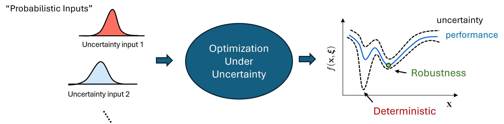

<figure markdown>
  { width="1000" }
</figure>

# PyEGRO: Python for Efficient Global Robust Optimization

## Overview
**PyEGRO** is a Python library designed for solving complex engineering problems with efficient global robust optimization. It provides tools for initial design sampling, metamodeling, sensitivity analysis, uncertainty quantification and robust optimization. 

---

## Key Modules

### 1. **Design of Experiments**
- Advanced sampling methods:
  - **Latin Hypercube Sampling (LHS)**
  - **Sobol Sequence**
  - **Halton Sequence**
  - Design variables and environmental variables (deterministic and stochastic).
  - Multi-dimensional Input.
- Customizable sampling criteria for enhanced precision.

### 2. **Metamodeling**
- Supports **Gaussian Process Regression (GPR) or Kriging**  and Multi-Fidelity using **Co-Kriging** metamodel

- Using **Polynomial Chaos Expansion (PCE)** in uncertainty quntification and support in robust optimization loop

- Real-time progress visualization.

### 3. **EGO for Metamodeling**
Provides multiple acquisition functions:

  - ***Expected Improvement (EI) and Boosting the Exploration term (𝜁-EI)***
  - ***Exploration Enhanced EI (E3I)*** [<a href="#reference-1" style="color:red; text-decoration:underline;">1</a>]
  - ***Expected Improvement for Global Fit (EIGF)*** [<a href="#reference-2" style="color:red; text-decoration:underline;">2</a>]
  - ***Distance-Enhanced Gradient (CRI3)*** [<a href="#reference-3" style="color:red; text-decoration:underline;">3</a>]

Comprehensive training configurations for meta models and Built-in visualization and performance tracking.

### 4. **Robust Optimization**
- Support techniques: **Monte Carlo Simulation (MCS)** and **Polynomial Chaos Expansion (PCE)** 
- Able to use **Artificial Neural Network (ANN)** in robust optimization loop call Two-Stage approach.
- Hyperparameter optimization using [Optuna](https://optuna.org/).
- Multi-objective Pareto solutions.
- Both direct function and surrogate-based evaluations supported.

### 5. **Global Sensitivity Analysis**
- **Sobol' indices** for quantifying sensitivity.
- Seamless analysis with true or surrogate functions.
- Built-in visualization tools for insightful results.

### 6. **Uncertainty Quantification**
- Monte Carlo Simulation methods for uncertainty propagation:
- Moment estimation.
- Distribution analysis (Kernel density function, KDF).
- Reliability and Risk Assessment
- Visualization of Mean and Confidence bounds on surrogate model (1D and 2D)
- Data logging in .csv for post-processing 

---

## 👤 About the Author

**Thanasak Wanglomklang**  
PhD Student in Mechanical Engineering  

Hi, I’m Thanasak, a PhD student in Mechanical Engineering at École Centrale de Lyon, supervised by [Sébastien Besset](https://scholar.google.com/citations?user=mX1HMLcAAAAJ&hl=en) and [Frédéric Gillot](https://scholar.google.fr/citations?user=SuvV3LoAAAAJ&hl=fr). My research focuses on optimization under uncertainty, and computational vibro-acoustics, with applications in aircraft cabin shape optimization for noise reduction. I’m developing PyEGRO, a tool to address these challenges in my research. In future, aiming to support uncertainty-aware engineering design.

- **Email**: [thanasak.wanglomklang@ec-lyon.fr](mailto:thanasak.wanglomklang@ec-lyon.fr)  
- **Personal Website**: [twanglom.github.io](https://twanglom.github.io)  

---

## 👥 Community and Contributions
We welcome contributions to **PyEGRO**! Visit our [GitHub repository](https://github.com/twanglom/PyEGRO) to raise issues, submit pull requests, or explore the source code.

---

## References
1. Berk, J., Nguyen, V., Gupta, S., Rana, S., & Venkatesh, S. (2019). Exploration enhanced expected improvement for Bayesian optimization. In *Machine Learning and Knowledge Discovery in Databases: European Conference, ECML PKDD 2018, Dublin, Ireland, September 10–14, 2018, Proceedings, Part II 18* (pp. 621-637). Springer International Publishing.

2. Lam, C. Q. (2008). Sequential adaptive designs in computer experiments for response surface model fit (Doctoral dissertation, The Ohio State University).

3. Shimoyama, K., & Kawai, S. (2019). A kriging-based dynamic adaptive sampling method for uncertainty quantification. *Transactions of the Japan Society for Aeronautical and Space Sciences, 62*(3), 137-150.

---

## License
**---**

