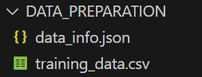

# Design of Experiment / Usage

This document provides examples for using the PyEGRO DOE module across different scenarios. The examples showcase variable definition, sampling methods, and saving/loading configurations.


### Default Settings Usage

**Goal**:

Run the sampling process with default settings for rapid setup and testing.

**Code**:

```python
from PyEGRO.initial_design import InitialDesign

# Create objective function 
def objective_function(x):
    x1, x2 = x[:, 0], x[:, 1] # format of input variable
    y = x1**2 + x2**2 # Simple quadratic function
    return y  

# Create design with default settings
design = InitialDesign(
    sampling_method='lhs',  # Default: Latin Hypercube Sampling
    show_progress=True
)

# Define a basic design variable
design.add_design_variable(
    name='x1',
    range_bounds=[-5, 5],
    cov=0.1,
    description='First variable'
)
design.add_design_variable(
    name='x2',
    range_bounds=[-6, 6],
    cov=0.1,
    description='Second variable'
)

# Save data to file
design.save()

# Run the sampling process
design.run(
    objective_function=objective_function,
    num_samples=10  # Default number of samples
)

```

**Output**:

1. `training_data.csv`: Contains generated samples with default settings.
2. No additional configuration files are created unless explicitly saved.





### 1. Basic LHS Sampling
**Goal**:
Generate samples using Latin Hypercube Sampling (LHS) with two design variables.

**Code**:
```python
from PyEGRO.initial_design import InitialDesign

def objective_function(x):
    return x[:, 0]**2 + x[:, 1]**2  # Simple quadratic function

design = InitialDesign(
    output_dir='DATA_PREPARATION_LHS',
    sampling_method='lhs',
    sampling_criterion='maximin',
    show_progress=True
)

# Define design variables
design.add_design_variable(
    name='x1',
    range_bounds=[-5, 5],
    cov=0.1,
    description='First variable'
)
design.add_design_variable(
    name='x2',
    range_bounds=[-6, 6],
    cov=0.1,
    description='Second variable'
)

# Save configuration and run sampling
design.save("lhs_config")
results = design.run(
    objective_function=objective_function,
    num_samples=50
)
```
**Output**:
1. `lhs_config.json`: Contains design configuration.
2. `training_data.csv`: Generated samples and objective function values.

---

### 2. Sobol Sequence Sampling
**Goal**:
Generate samples using the Sobol sequence for a low-discrepancy sampling approach.

**Code**:
```python
from PyEGRO.initial_design import InitialDesign

def objective_function(x):
    return (x[:, 0] - 1)**2 + (x[:, 1] - 2)**2

design = InitialDesign(
    output_dir='DATA_PREPARATION_SOBOL',
    sampling_method='sobol',
    show_progress=True
)

# Define design variables
design.add_design_variable(
    name='x1',
    range_bounds=[-5, 5],
    cov=0.2,
    description='Variable x1'
)
design.add_design_variable(
    name='x2',
    range_bounds=[-6, 6],
    cov=0.2,
    description='Variable x2'
)

# Save configuration and run sampling
design.save("sobol_config")
results = design.run(
    objective_function=objective_function,
    num_samples=100
)
```
**Output**:
1. `sobol_config.json`
2. `training_data.csv`

---

### 3. Mixed Variable Types
**Goal**:
Generate samples with both design and environmental variables.

**Code**:
```python
from PyEGRO.initial_design import InitialDesign

def objective_function(x):
    return x[:, 0]**2 + 3 * x[:, 1]

design = InitialDesign(
    output_dir='DATA_PREPARATION_MIXED',
    sampling_method='lhs',
    show_progress=True
)

# Define design variable
design.add_design_variable(
    name='x1',
    range_bounds=[-5, 5],
    cov=0.1,
    description='Design variable x1'
)

# Define environmental variable
design.add_env_variable(
    name='env1',
    distribution='normal',
    mean=10,
    cov=0.2,
    description='Environmental variable env1'
)

# Save configuration and run sampling
design.save("mixed_config")
results = design.run(
    objective_function=objective_function,
    num_samples=50
)
```
**Output**:
1. `mixed_config.json`
2. `training_data.csv`

---

### 4. Random Sampling
**Goal**:
Generate samples using uniform random sampling.

**Code**:
```python
from PyEGRO.initial_design import InitialDesign

def objective_function(x):
    return x[:, 0] * x[:, 1]

design = InitialDesign(
    output_dir='DATA_PREPARATION_RANDOM',
    sampling_method='random',
    show_progress=True
)

# Define design variables
design.add_design_variable(
    name='x1',
    range_bounds=[0, 10],
    cov=0.05,
    description='Random variable x1'
)
design.add_design_variable(
    name='x2',
    range_bounds=[-10, 0],
    cov=0.05,
    description='Random variable x2'
)

# Save configuration and run sampling
design.save("random_config")
results = design.run(
    objective_function=objective_function,
    num_samples=20
)
```
**Output**:
1. `random_config.json`
2. `training_data.csv`

---

### 5. Loading and Reusing Configurations
**Goal**:
Reuse a saved configuration to generate new samples.

**Code**:
```python
from PyEGRO.initial_design import InitialDesign

def objective_function(x):
    return x[:, 0] + x[:, 1]

# Load configuration
design = InitialDesign(
    output_dir='DATA_PREPARATION_REUSE',
    sampling_method='lhs'
)
design.load("lhs_config")

# Run with different sample count
results = design.run(
    objective_function=objective_function,
    num_samples=100
)
```
**Output**:
1. Updated `training_data.csv`

---

