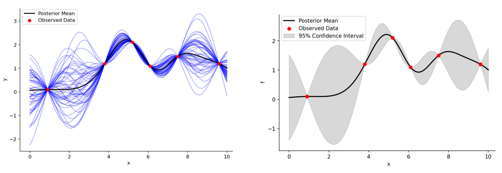

# Surrogate Modeling / Overview

Surrogate modeling is a powerful tool used to approximate response of complex systems with represent mathematical models.

### **Gaussian Process Regression (GPR)**

The **PyEGRO** library supports **Gaussian Process Regression (GPR)**, which is ideal for capturing nonlinear relationships while providing model uncertainty estimation. Built on top of [GPyTorch](https://gpytorch.ai/) which support using GPU computing, this library simplifies the construction of GPR models and is designed for seamless integration within the PyEGRO modular framework.

### **Key Features**

**Gaussian Process Regression (GPR):**

   - Supports Matérn Kernel with Automatic Relevance Determination (ARD).
   - Provides posterior mean and variance for predictions.
   - Device-agnostic implementation (CPU/GPU support).

**Device Management:**

   - Automatically selects CPU or GPU based on system availability.
   - Optimized training and evaluation for hardware capabilities.

**Model Evaluation:**

   - Scalable evaluation of predictions with batch processing.
   - Automatic scaling of inputs and outputs for stable training.

**Progress Tracking:**

   - Rich progress bars for training loops.
   - Early stopping with customizable patience levels.

**Model Saving:**

   - Enable to save trained model allow importing for prediction.

### **Basics Formulation**

**Gaussian Process Regression:**

   Given training data \( (X, y) \), a ***GPR model*** assumes:

$$ y(X) \sim \mathcal{GP}(m(X), k(X, X')) $$

where:
- \( m(X) \): Mean function (constant by default).
- \( k(X, X') \): Covariance function (Matérn kernel).

**Matérn Kernel with ARD:**

   The covariance function for inputs \( X \) and \( X' \) is:

$$ k(X, X') = \sigma^2 \left(1 + \frac{\sqrt{5} r}{l} + \frac{5r^2}{3l^2}\right) \exp\left(-\frac{\sqrt{5} r}{l}\right) $$

where:
- \( r = \|X - X'\| \): Euclidean distance.
- \( l \): Lengthscale parameter (ARD for input dimensions).
- \( \sigma^2 \): Signal variance.

**Training Objective:**

   The model minimizes the negative marginal log likelihood (NMLL):

$$ \mathcal{L} = -\log p(y \mid X) $$

**Response and prediction variance estimation:**

   Predictions provide both mean and variance:

$$ \hat{y} = m(X) + k(X, X')k(X', X')^{-1}(y - m(X')) $$

$$ \sigma^2(X) = k(X, X) - k(X, X')k(X', X')^{-1}k(X', X) $$

